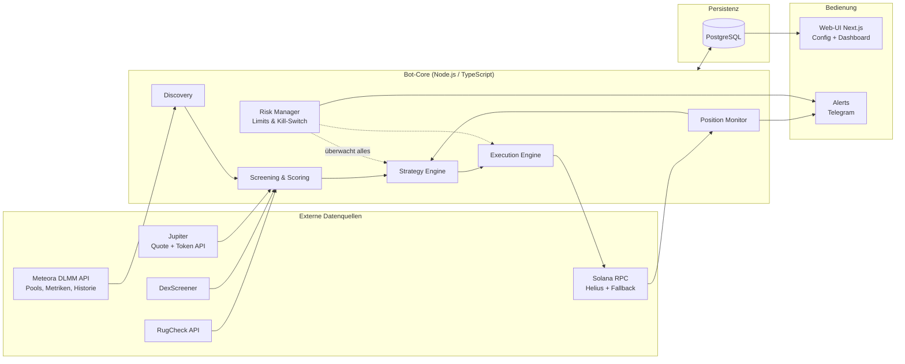
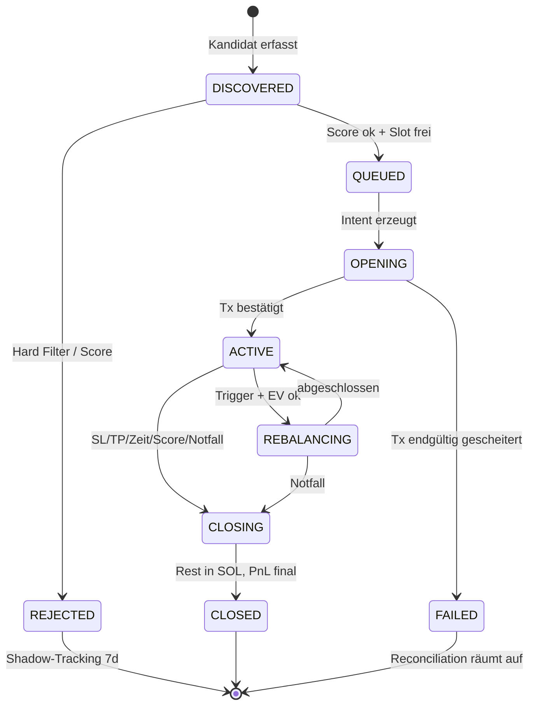

# Konzept: Automatisierter Meteora-DLMM-LP-Bot (Solana)

> Automatisiertes Liquidity Providing auf Meteora DLMM: eigene Pool-Discovery,
> mehrstufige Filterung bösartiger und schlechter Pools, automatisches Eröffnen,
> Rebalancen und Schließen von Positionen, Web-UI zur Parametersteuerung sowie
> ein Analyse-Dashboard zur Effizienzmessung.

Dieses Dokument beschreibt **Strategie und Risikomodell**. Die datengetriebene
Optimierung steht in [KONZEPT-ML.md](./KONZEPT-ML.md), die Bedienung in
[README.md](./README.md). Der Umsetzungsstand ist in Abschnitt 16
zusammengefasst; einzelne Abschnitte markieren Abweichungen dort, wo sie für das
Verständnis wichtig sind.

---

## 1. Ziele und Nicht-Ziele

**Ziele**

1. Kontinuierliche Entdeckung attraktiver DLMM-Pools aus den Meteora-Marktdaten.
2. Systematisches Aussortieren von Rug-, Honeypot- und Wash-Trading-Pools
   **bevor** Kapital eingesetzt wird.
3. Vollautomatischer Positions-Lebenszyklus: Eröffnen → Überwachen → Fees
   claimen → Rebalancen → Schließen, inklusive Notausstieg.
4. Web-UI: alle Strategie- und Risikoparameter zur Laufzeit anpassbar,
   Kill-Switch, Positionsübersicht.
5. Analyse-Dashboard: PnL, Fee-Erträge, Impermanent Loss, Kostenaufschlüsselung,
   Filter-Trefferquote — pro Position, Pool und Preset.
6. Risikominimierung als durchgängiges Designprinzip: Kapital-Caps, Circuit
   Breaker, Paper-Trading-Modus, Schlüsselsicherheit.

**Nicht-Ziele (v1)**

- Kein Hebel, keine Derivate, kein Cross-Chain.
- Kein HFT oder MEV-Searching — der Bot ist ein LP-Manager, kein Sniper.
- Keine DAMM-v2-Pools; die Architektur lässt eine spätere Erweiterung zu.

**Grundhaltung:** LPing auf frische Memecoin-Pools ist strukturell hochriskant.
Das Konzept behandelt den Totalverlust einzelner Positionen als *erwartbares*
Ereignis und steuert deshalb primär über Positionsgrößen, Limits und schnelle
Exits — nicht über die Illusion, jeden Rug erkennen zu können.

---

## 2. Fachlicher Hintergrund: Meteora DLMM

Für die Design-Entscheidungen relevante Eigenschaften des Dynamic Liquidity
Market Maker:

- **Bins.** Liquidität liegt in diskreten Preis-Bins. Gebühren verdienen die
  Bins, die ein Swap **durchläuft** — bei kleinen Swaps also der aktive Bin, bei
  großen mehrere. Der Abstand zwischen Bins ist der **Bin Step** in Basispunkten;
  volatile Paare nutzen große Schritte (100–400 bps), stabile kleine (1–25 bps).
- **Bin-Preis** `p(i) = (1 + binStep/10000)^i`; die Range-Breite ist
  Bins × Bin Step. Eine Position startet mit 70 Bins und ist auf bis zu 1.400
  erweiterbar.
- **Dynamische Gebühr.** Basisgebühr + volatilitätsabhängiger Aufschlag, gedeckelt
  bei 10 %. In volatilen Phasen steigen die LP-Erträge — genau dann ist aber auch
  das Verlustrisiko am höchsten.
- **Protokollanteil.** 10 % der Handelsgebühr bei Standard-Pools, 20 % bei
  Launch-Pools gehen ans Protokoll. Der LP erhält nur den Rest.
- **Positionsform.** Beim Einzahlen wählt man eine Liquiditätsverteilung: `Spot`
  (gleichmäßig), `Curve` (um den aktiven Bin konzentriert), `BidAsk` (an den
  Rändern konzentriert). Einseitige Positionen sind möglich — nur SOL unterhalb
  des Preises entspricht einer gestaffelten Kauforder, nur Token oberhalb einer
  gestaffelten Verkaufsorder.
- **Composition Fee.** Eine Einzahlung in den **aktiven** Bin, die dessen
  Zusammensetzung verändert, kostet zusätzlich — sie ähnelt einem Swap.
- **Kein Auto-Compounding.** Fees müssen aktiv geclaimt werden.
- **Impermanent Loss.** Läuft der Preis durch die Range, hält die Position am
  Ende nur noch den schwächeren Token. Bei Memecoins heißt das: Wer nicht
  rechtzeitig aussteigt, hält Bags eines toten Tokens. Gebühren kompensieren IL
  nur bei ausreichend Volumen und begrenztem Drawdown.

### 2.1 Gebührenwährung: `collect_fee_mode`

DLMM erhebt die Swap-Gebühr je nach Pool-Konfiguration unterschiedlich, und für
das Risikoprofil ist das eine Größe erster Ordnung:

| Modus | Wert | Bedeutung |
|---|---|---|
| `InputOnly` | `0` | Gebühr im **Input-Token** des Swaps — folgt der Handelsrichtung |
| `OnlyY` | `1` | Gebühr **immer in Token Y**, auch wenn Y der Output ist |

Bei `InputOnly` in einem X/SOL-Pool fallen Gebühren gemischt an: Käufe zahlen in
SOL, Verkäufe im Token. Eine einseitige SOL-Bid-Position wird gefüllt, während
Verkäufer in sie hineinhandeln — sie verdient also überwiegend **Token-Gebühren**,
und die sind offenes Exposure bis zur Konvertierung.

Bei `OnlyY` **und SOL auf der Y-Seite** entfällt dieses Exposure vollständig: alle
Gebühren fallen in SOL an. Die Seitenprüfung ist dabei entscheidend — steht SOL
auf der X-Seite, kehrt derselbe Modus den Vorteil ins Gegenteil, weil dann alle
Gebühren im Memecoin anfallen. Maßgeblich ist also
`collect_fee_mode == 1 && mintY == WSOL`, implementiert als `feeCurrencyOf()`.

Der Modus steht in jeder `/pools`-Antwort und wird als Merkmal aufgezeichnet. Er
ist damit ein Kandidat für einen Discovery-Filter, nicht eine Fußnote.

### 2.2 SDK-Abdeckung

`@meteora-ag/dlmm` (TypeScript), verifiziert am Quellcode. Wird erst mit der
Execution Engine gebraucht — bislang ist keine dieser Methoden im Einsatz.

| Bedarf | SDK-Methode |
|---|---|
| Pool instanziieren | `DLMM.create(connection, poolAddress)` |
| Aktiven Bin/Preis lesen | `getActiveBin()`, `getBinsAroundActiveBin()` |
| Position eröffnen | `initializePositionAndAddLiquidityByStrategy()` |
| Liquidität nachlegen | `addLiquidityByStrategy()` |
| Fees claimen | `claimSwapFee()` / `claimAllSwapFee()` / `claimAllRewards()` |
| Liquidität abziehen | `removeLiquidity()` |
| Position schließen | `closePosition()` / `closePositionIfEmpty()` |
| Rebalance (nativ) | `simulateRebalancePosition()` + `rebalancePosition()` |
| Bestandsaufnahme | `DLMM.getAllLbPairPositionsByUser()` |
| Quotes/Swaps im Pool | `swapQuote()`, `swap()` |
| Fee-Zustand | `getFeeInfo()`, `getDynamicFee()` |

### 2.3 Die Pool-API und was sie ermöglicht

`dlmm.datapi.meteora.ag` (ältere Variante: `dlmm-api.meteora.ag`) liefert pro
Pool `tvl`, Volumen und Gebühren je Zeitfenster (30 m…24 h), `apr`/`apy`,
`bin_step`, `base_fee_pct`, `dynamic_fee_pct`, `protocol_fee_pct`,
`collect_fee_mode`, `current_price` sowie Token-Angaben. Dokumentiertes Limit:
**30 Anfragen/s**.

Drei Fähigkeiten prägen die Umsetzung:

| Fähigkeit | Wozu genutzt |
|---|---|
| `sort_by=<metrik>_<fenster>:<richtung>` | mehrere Sortierungen zusammenführen, damit frische Pools überhaupt sichtbar werden (Abschnitt 4) |
| `filter_by=pool_address=[a\|b\|…]` | Sammelabruf: Messpunkte für alle verfolgten Pools in ~50 statt 2.000 Anfragen |
| `/pools/{address}/ohlcv` und `/volume/history` | **rückwirkender** Preis-, Volumen- und Gebührenverlauf bis auf 5-Minuten-Kerzen |

Der letzte Punkt wirkt weit über die Discovery hinaus: Ein Teil der Zeitreihe,
die die Optimierung braucht, ist nachholbar. TVL und SOL-Kurs sind es nicht —
die gibt es nur als Momentaufnahme. Ausführlich in KONZEPT-ML.md Abschnitt 3.3.

---

## 3. Gesamtarchitektur

### 3.1 Komponentenübersicht

Execution Engine, Position Monitor und Risk Manager sind geplant, aber noch nicht
umgesetzt (Abschnitt 16).

### 3.2 Tech-Stack

| Schicht | Wahl | Begründung |
|---|---|---|
| Sprache/Runtime | TypeScript auf Node.js 20+ | Offizielles DLMM-SDK ist TS; ein Ökosystem für Bot und UI |
| Solana | `@solana/web3.js`, `@meteora-ag/dlmm`, Jupiter Swap API | Offizielle und etablierte Bausteine |
| RPC | Helius (primär) + Zweitanbieter (Fallback), eigene Priority-Fee-Schätzung | Zuverlässige Tx-Landung ist kritisch |
| Persistenz | PostgreSQL mit Prisma | Relationale Auswertbarkeit; ein einziges zusätzliches System |
| UI | Next.js | Schnelle Entwicklung |
| Deployment | Docker Compose auf VPS, `.env` für Secrets | Reproduzierbar, einfach |
| Alerting | Telegram-Bot | Sofortige Reaktionsfähigkeit |

**Kernprinzip:** Alle Entscheidungslogik — Scoring, Strategie, Risk — ist pure
und ohne Netzwerk oder Chain testbar; Adapter und Execution sind dünne,
austauschbare Schalen. Genau das macht Paper-Trading und Replay auf **identischem
Codepfad** möglich (Abschnitt 13, KONZEPT-ML.md 5).

---

## 4. Pool-Discovery

Die Discovery arbeitet ausschließlich auf den Meteora-Marktdaten. Sie bildet die
Preset-Kategorien selbst nach, statt sich auf eine fremde Trending-Liste zu
stützen.

> **Historie dieser Entscheidung.** Ursprünglich war [Fabriq](https://fabriq.trade)
> als primäre Quelle vorgesehen. Ein Spike ergab: Die Trending-Seite liefert ihre
> Daten nicht über abgreifbare JSON-Endpoints, und ein Zugriff über
> Session-Cookies wurde verworfen (manuelle Token-Erneuerung, Kontoschlüssel im
> Klartext auf dem Server, ToS-Risiko). Ein defensiver Adapter liegt weiterhin
> unter `packages/adapters/src/fabriq/` und lässt sich über `fabriq:check`
> aktivieren, falls je ein stabiler Endpoint auftaucht — der Bot hängt aber an
> keiner Stelle davon ab.

### 4.1 Mehrere Sortierungen statt mehr Seiten

Die Pool-API sortiert standardmäßig nach 24-Stunden-Volumen. Wer nur die ersten
Seiten davon liest, sieht ausschließlich etablierte Pools — ein Pool, der vor drei
Stunden entstand, kann per Definition kein hohes Tagesvolumen haben. Genau solche
Pools sind aber das Degen-Fenster.

Die Suche führt deshalb **mehrere Sortierungen** zusammen und dedupliziert nach
Pool-Adresse:

| Sortierung | Beantwortet |
|---|---|
| `volume_24h:desc` | etablierte Aktivität — trägt die längerfristigen Presets |
| `fee_tvl_ratio_1h:desc` | aktuelle Ertragskraft — Pools, die gerade anfangen zu verdienen |
| `pool_created_at:desc` | neue Pools — über Volumen nicht erreichbar |

Serverseitig gefiltert wird nur, was für **jedes** Preset gilt
(`is_blacklisted=false && tvl>=…`). Der Filter ist Vorauswahl, nicht Entscheidung:
Abgelehnt wird ausschließlich im Screening, mit Begründung im Scanner. Ein zu
scharfer Serverfilter ließe Kandidaten unsichtbar verschwinden, statt sie
nachvollziehbar auszuweisen.

Die Quote-Token-Prüfung bleibt clientseitig, weil `filter_by` seine Ausdrücke nur
mit UND verknüpft und SOL Token X *oder* Token Y sein kann.

### 4.2 Ablauf

- Jeder gefundene Pool durchläuft einen billigen, rein lokalen Vor-Filter
  (Bin Step, Basisgebühr, TVL, Volumen/TVL) und wird je Preset in eine Shortlist
  einsortiert. Die Schwellwerte liegen bewusst unter denen des Screenings —
  Ablehnen ist Aufgabe des Screenings, nicht der Discovery.
- Nur die Shortlist geht ins teure Enrichment (DexScreener, RugCheck, Jupiter).
- Jeder gescreente Kandidat wird persistiert, **auch der abgelehnte** — er ist
  die Grundlage der Filter-Kalibrierung (5.5) und des Auswahlmodells
  (KONZEPT-ML.md 3.1).

---

## 5. Screening & Scoring

Zweistufig: **Hard Filters** (K.-o.-Kriterien, billige zuerst) → **Score** (0–100
für Ranking und Mindestscore je Preset). Quellen sind RugCheck
(Token-Risiko-Report), DexScreener (Markt-Querschnitt), Jupiter
(Ausführbarkeit) und perspektivisch eigene On-Chain-Reads als Wahrheit letzter
Instanz.

**Fail-closed ist das Grundprinzip:** Bei sicherheitskritischen Prüfungen führt
fehlende Information zur Ablehnung. „Keine Daten" ist nie „unbedenklich".

### 5.1 Token-Sicherheit

| Prüfung | Regel | Quelle | Stand |
|---|---|---|---|
| Mint Authority | muss revoked sein | On-Chain (Mint-Account) | über RugCheck |
| Freeze Authority | muss revoked sein, sonst einfrierbare Wallets = Honeypot-Vektor | On-Chain | über RugCheck |
| Token-2022-Extensions | Transfer Fee > 0, Transfer Hook, Permanent Delegate, nicht-transferierbar → Ablehnung | On-Chain | **fehlt** |
| Verkaufbarkeit | Jupiter-Quote in **beide** Richtungen mit plausiblem Preis-Impact | Jupiter | ✅ |
| RugCheck-Report | normalisierter Score über Schwellwert oder kritische Flags → Ablehnung | RugCheck | ✅ |
| Metadaten | mutable Metadata nur als Score-Malus, nicht K. o. (zu viele False Positives) | RugCheck | ✅ |

Die beiden Authority-Prüfungen kommen derzeit ausschließlich von RugCheck. Ein
eigener On-Chain-Read wäre die belastbarere Quelle; die Token-2022-Prüfung fehlt
mangels RPC-Adapter ganz. Beides gehört zur Execution-Ausbaustufe.

### 5.2 Holder & Verteilung

| Prüfung | Konservativ | Balanced | Degen |
|---|---|---|---|
| Top-10-Holder-Anteil | < 20 % | < 25 % | < 30 % |
| Größter Einzel-Holder | < 6 % | < 8 % | < 10 % |
| Insider-/Bundler-Anteil | < 8 % | < 12 % | < 20 % |
| Holder-Anzahl | ≥ 2.000 | ≥ 800 | ≥ 250 |

Der Top-10-Anteil sollte LP- und Burn-Adressen ausnehmen; derzeit tut er das
nicht, was den Filter strenger macht als beabsichtigt (der Pool-Reserve-Account
selbst ist bei jungen Token oft ein Top-Holder).

### 5.3 Markt- & Pool-Qualität

| Prüfung | Zweck | Stand |
|---|---|---|
| TVL ≥ Preset-Minimum | Exit-Fähigkeit | ✅ |
| Eigene Positionsgröße ≤ x % des Pool-TVL | eigener Preis- und Exit-Impact | ✅ |
| Volumen-Plausibilität `vol24h/TVL` im Preset-Band | zu niedrig = tot, absurd hoch = Wash-Trading-Verdacht | ✅ |
| Wash-Trading-Heuristik über die durchschnittliche Trade-Größe | Fake-Aktivität erkennen | ✅ |
| Preis-Konsistenz Pool vs. Marktpreis | manipulierte oder illiquide Pools | ✅ |
| Quote-Token = SOL | ein einziges Bewertungs- und Exit-Asset | ✅ |
| Token-Alter im Preset-Fenster | Preset-Definition | ✅ |
| Pool nicht von einer einzigen LP-Wallet dominiert | plötzlicher Liquiditätsabzug Dritter | **fehlt** (braucht RPC) |

### 5.4 Score (0–100)

Gewichtete Summe; die Kennlinien sind bewusst einfache Startwerte, die
datengetrieben kalibriert werden sollen (KONZEPT-ML.md 6.3).

| Gewicht | Komponente | Grundlage |
|---|---|---|
| 35 | Fee-Ertragskraft | Fee/TVL-Rate |
| 25 | Markt-Qualität | Kauf/Verkauf-Balance, plausible Trade-Größe, Handelsaktivität |
| 20 | Sicherheitsmarge | Abstand zu Risk-Score- und Holder-Grenzwerten |
| 10 | Momentum | Preistrend; über dem Ideal-Band wird abgewertet, denn parabolische Pumps sind Risiko, nicht Qualität |
| 10 | Quellen-Bonus | ursprünglich für externe Bestätigung gedacht |

Einstieg nur bei Score ≥ Preset-Mindestscore **und** freiem Positions-Slot; bei
mehreren Kandidaten gewinnt der höchste Score.

Zwei bekannte Schwächen: Der Quellen-Bonus vergibt mangels zweiter Quelle an alle
Kandidaten denselben Wert und trägt damit nichts zur Unterscheidung bei. Und die
Fee-Ertragskraft wird über das 24-Stunden-Fenster gemessen — für einen drei
Stunden alten Pool ist dieses Fenster naturgemäß dünn belegt, was frische Pools
gegenüber etablierten systematisch benachteiligt. Beide Punkte sind Kandidaten
für die Kalibrierung.

### 5.5 Filter-Kalibrierung durch Shadow-Tracking

Jeder **abgelehnte** Kandidat wird sieben Tage weiterverfolgt (Preis, TVL,
Rug-Ereignis). Daraus lassen sich die beiden Fehlerarten messen: zu Unrecht
blockiert und gut gelaufen (False Positive) gegen durchgelassen und gerugged
(False Negative). Damit werden Schwellwerte datengetrieben statt gefühlt
nachjustiert.

Die Daten werden erfasst; die Auswertung im Dashboard steht noch aus.

---

## 6. Strategy Engine: Risikoprofile

Ein Preset bündelt Discovery-Fenster, Filter-Schwellen, Einstiegsform,
Range-Design, Rebalance- und Exit-Regeln. Presets sind frei benennbar — eine
zusätzliche Datei in `config/` erscheint automatisch in UI, Paper-Vergleich und
Replay.

Ausgeliefert werden drei Profile. Sie laufen **gleichzeitig auf denselben
Marktdaten und mit demselben virtuellen Kapital**, sodass Ergebnisunterschiede
ausschließlich von den Parametern stammen.

### 6.1 Die drei Profile

| | **Konservativ** | **Balanced** | **Degen** |
|---|---|---|---|
| Horizont | Tage bis zwei Wochen | Tage | Stunden |
| Token-Alter | ≥ 7 Tage | ≥ 2 Tage | 1–48 h |
| Min. TVL | 250 k$ | 120 k$ | 50 k$ |
| Vol/TVL-Band | 0,5–15 | 1–25 | 2–50 |
| Min. Bin Step | 10 | 20 | 100 |
| Min. Basisgebühr | 0,05 % | 0,2 % | 1 % |
| Einstieg | Curve, 50/50 | Curve, 50/50 | BidAsk, **einseitig SOL** |
| Bins | 60–69 | 40–60 | 20–40 |
| Mindestscore | 65 | 60 | 65 |
| Fee-Claim | alle 6 h | alle 2 h | alle 30 min |
| Fees → SOL | 100 % | 75 % | 100 % |
| Stop-Loss | 15 % | 20 % | 15 % |
| Take-Profit | 40 % | 50 % | 30 % |
| Max. Haltedauer | 14 Tage | 4 Tage | 24 h |
| Rebalancing | ja (Puffer 15 %, Cooldown 4 h, max. 2/Tag, EV ≥ 3×) | ja (10 %, 2 h, 4/Tag, EV ≥ 2×) | nein |
| Slippage-Cap | 0,5 % | 1 % | 3 % |
| Kapitalanteil (live) | 40 % | 35 % | 25 % |
| Positionsgröße | 3 % | 2 % | 1 % |

### 6.2 Warum Degen einseitig einsteigt

Der Degen-Einstieg legt **nur SOL** unterhalb des aktiven Bins ab, in BidAsk-Form.
Die Logik: Gebühren fließen, sobald der Preis in die Range handelt, und
Token-Exposure entsteht nur durch echte Fills — ein DCA in den Rückgang statt
eines sofortigen 50/50-Kaufs eines frischen Memecoins.

Eine solche Position liegt per Konstruktion **außerhalb** der Range und wartet
dort auf Befüllung. Das ist kein Fehlzustand, sondern das von Meteora
beschriebene Muster. Erreicht der Markt sie nie, greift das Zeitlimit — der
richtige Ausgang für eine Kauforder, zu der der Markt nicht gekommen ist.

Läuft der Preis über die Range hinaus (Position vollständig in SOL, Gebühren
realisiert), wird geschlossen und der Pool neu bewertet. Nachjagen ist ein
bewusster, separater Entscheid, kein Automatismus.

### 6.3 Portfolio-Constraints (Risk Manager)

> **Diese Regeln sind noch nicht scharf.** Die Parameter existieren, sind
> zod-validiert und in der UI editierbar; durchgesetzt wird bislang nur das
> Positionslimit je Preset. Im Paper-Modus folgenlos — vor Phase 2 muss der Risk
> Manager stehen und getestet sein, sonst geht genau der Pfad ungeprüft live, der
> Verluste begrenzen soll.

- Max. gleichzeitige Positionen je Preset **und** global (`maxOpenPositions`).
  Zu beachten: Das Schema prüft jedes Preset einzeln gegen die globale Grenze,
  nicht die Summe — erst die globale Durchsetzung macht daraus ein echtes Limit.
- Max. Gesamt-Exposure in SOL; Mindest-SOL-Reserve für Gebühren und Exits.
- Max. eine Position pro Token-Mint; Obergrenze für neue Entries pro Stunde.
- **Circuit Breaker:** Tagesverlustlimit → keine neuen Entries für 24 h; zweiter
  Schwellwert → alles schließen, Kill-Switch, Alert.

---

## 7. Execution Engine

*Geplant, nicht umgesetzt.* Zuständig für jede Chain-Interaktion; die Strategy
Engine gibt nur Intents („öffne Position X mit Parametern Y").

- **Tx-Pipeline:** bauen → `simulateTransaction` (Pflicht) → Priority Fee
  dynamisch mit Cap → senden → Bestätigung mit Timeout → bei Expiry idempotent
  neu versuchen (Blockhash-Erneuerung, begrenzte Versuche, exponentieller
  Backoff).
- **Swaps** für Entry-Vorbereitung, Fee-Konvertierung und Exit-Reste via Jupiter
  mit hartem Slippage-Cap und Preis-Impact-Check; optional als Jito-Bundle gegen
  Sandwiching.
- **Idempotenz und Crash-Sicherheit:** Jeder Intent hat eine ID und wird vor dem
  Senden persistiert. Nach einem Neustart werden On-Chain-Zustand und Datenbank
  abgeglichen — verwaiste Positionen adoptiert, halb ausgeführte Intents
  aufgeräumt.
- **RPC-Failover:** Health-Check beider Endpunkte, bei Primärausfall automatischer
  Wechsel und Alert.
- **Kostenerfassung:** Jede Transaktion protokolliert Priority Fee, Signatur-Fee,
  Swap-Fee und Preis-Impact → fließt in den Netto-PnL.

---

## 8. Monitoring, Fee-Management & Rebalancing

*Überwiegend geplant; im Paper-Modell sind Fee-Claim, Konvertierungskosten und
Rebalancing simuliert.*

### 8.1 Monitoring

- Pro aktiver Position: aktiver Bin, Lage zur Range, unclaimed Fees,
  Positionswert in SOL, Pool-TVL- und Volumen-Deltas.
- Frequenz: Degen 15–30 s, längerfristige Presets 60 s; zusätzlich
  Account-Subscription über WebSocket, wo möglich.
- Abgeleitet: Time-in-Range, realisierte Fee-APR, Drawdown seit Entry.

### 8.2 Rebalancing

- **Trigger:** Der aktive Bin verlässt die inneren `100 − 2 × bufferPct` Prozent
  der Range.
- **Hysterese:** Mindestabstand zwischen Rebalances und Tageslimit verhindern
  Zappeln in Seitwärtsphasen.
- **EV-Check:** Der geschätzte Zusatzertrag über die Restlaufzeit muss die Kosten
  (Swap, Preis-Impact, Priority Fees, Composition Fee) um `minEvFactor`
  übersteigen — sonst warten oder Exit prüfen.
- **Ablauf:** Fees claimen → `simulateRebalancePosition()` → `rebalancePosition()`.
  Das ist **ein** Vorgang (claim, remove, resize, add); die Position wird nicht
  geschlossen und neu eröffnet, es fällt also keine erneute Rent an.
- **Richtungs-Asymmetrie:** Ein Rebalance nach unten ist zugleich ein
  Stop-Loss-Check. Die Exit-Logik hat Vorrang — nie in einen fallenden Preis
  nachzentrieren.
- **Degen rebalanciert nicht.** Positionen werden geschlossen und gegebenenfalls
  neu eröffnet: weniger Fehlerpfade, klarere PnL-Zuordnung.

### 8.3 Fee-Claiming & Konvertierung

Ob Gebühren überhaupt in Token anfallen, entscheidet `collect_fee_mode`
(Abschnitt 2.1). Für `OnlyY`-Pools mit SOL auf der Y-Seite ist alles Folgende
gegenstandslos — dort fallen Gebühren ohnehin nur in SOL an. Für alle übrigen
Pools ist die Konvertierung integraler Teil der Gewinnsicherung:

**Claim-Politik**

- Trigger: Preset-Intervall **oder** Wert-Schwelle — unclaimed Fees ≥
  max(`minClaimValueSol`, `claimCostFactor` × geschätzte Tx-Kosten).
- Pflicht-Claims vor jedem Rebalance, jedem Close und im Notausstieg.
- Batching: Ein Scheduler-Lauf claimt alle fälligen Positionen; Konvertierungen
  werden **pro Token über alle Positionen aggregiert**, damit sich die Fixkosten
  amortisieren.
- Farming-Rewards durchlaufen dieselbe Pipeline.

**Konvertierung via Jupiter**

- **Degen:** 100 % der Token-Gebühren sofort nach dem Claim in SOL. Ist der Swap
  nicht ausführbar, wird der Betrag als Dust vorgemerkt und spätestens beim Exit
  mitverkauft.
- **Längerfristige Presets:** `convertToSolPct` in SOL, der Rest optional als
  Compounding — aber nur, wenn die Position gesund ist und der Betrag über
  `compound.minSol` liegt.
- **Dust-Schwelle:** Swaps erst ab `dustThresholdSol`; kleinere Beträge sammeln
  sich und laufen beim nächsten Claim oder Exit mit. Sonst frisst Gas den Ertrag.

**Risiko-Sicht:** Unclaimte oder unkonvertierte Token-Gebühren sind offenes
Exposure. Im Rug-Fall sind konvertierte SOL-Gebühren gesichert, Token-Gebühren
folgen dem Token gegen null — daraus leitet sich die kurze Degen-Claim-Kadenz ab.
Gebühren werden zum Claim-Zeitpunkt in SOL bewertet, Konvertierungskosten separat
erfasst.

---

## 9. Exits, Notfall-Logik, Kill-Switch

**Geordneter Exit** (Stop-Loss, Take-Profit, Zeitlimit, Score-Verfall): Fees
claimen → `removeLiquidity` (100 %) → `closePosition` → Token-Rest via Jupiter in
SOL (bei Nichtausführbarkeit Teilverkäufe über mehrere Minuten) → PnL
festschreiben → Pool-Cooldown.

**Notausstieg bei Rug-Signalen** — höchste Priorität, überspringt EV-Checks:

| Signal | Schwelle (Default) |
|---|---|
| Preissturz | > 30 % in 5 min |
| TVL-Abzug | > 40 % in 10 min |
| Verkaufbarkeit weg | Jupiter-Quote schlägt fehl oder Impact > 25 % |
| Autoritäten-Änderung | neue Freeze-/Mint-Authority-Aktivität |
| Dev- oder Top-Holder-Dump | bekannter Insider verkauft über Schwelle |

Ablauf: sofort `removeLiquidity` mit hoher Priority Fee → alles in SOL im
Notmodus → Token und Deployer auf **permanente Blacklist** → Alert. Misslingt der
Verkauf, wird der Verlust realisiert protokolliert — kein wiederholtes Anrennen.

**Kill-Switch** (UI und Telegram): Stufe 1 „Pause" = keine neuen Entries oder
Rebalances, Monitoring läuft weiter. Stufe 2 „Flatten" = alle Positionen geordnet
schließen, alles in SOL.

> Die `emergency`-Schwellen sind konfigurierbar, werden aber noch von keiner Logik
> ausgewertet — auch nicht in der Simulation. Deren Verlust-Tail ist dadurch zu
> freundlich (KONZEPT-ML.md 10.1).

---

## 10. Zustandsmaschine & Datenmodell

### 10.1 Position-Lebenszyklus

Jeder Übergang wird mit Zeitstempel, Auslöser und Kontext in einem **Event-Log**
persistiert — der Audit-Trail ist die Datenbasis des Dashboards.

### 10.2 Kerntabellen (PostgreSQL)

**Handel und Betrieb**

| Tabelle | Inhalt |
|---|---|
| `pool_candidates` | entdeckte Pools mit Quelle, Roh-Metriken, Filter-Ergebnis (inklusive des ablehnenden Filters), Score, Shadow-Frist |
| `positions` | Zustand, Preset, Pool, Bin-Range, Einsatz, Wert, realisierter und unrealisierter PnL |
| `position_events` | Zustandsübergänge mit Auslöser |
| `transactions` | Signatur, Typ, Status, alle Kosten |
| `fee_claims` | Claim-Beträge je Token, SOL-Bewertung zum Claim-Zeitpunkt |
| `config_versions` | jede Parameteränderung versioniert (wer, wann, was) |
| `blacklist` | Mints, Deployer, Pools mit Grund |

**Datenaufzeichnung** — bewusst unabhängig von der Positions-Persistenz geführt,
denn der Datensatz soll gerade auch die Pools enthalten, in die nie investiert
wurde (KONZEPT-ML.md 3):

| Tabelle | Inhalt |
|---|---|
| `tracked_pools` | welche Pools verfolgt werden, seit wann und bis wann |
| `candidate_features` | Merkmalsvektor je Kandidat zum **Entscheidungszeitpunkt**, versioniert über `feature_version` |
| `candidate_outcomes` | Ergebnis-Labels je Horizont (1 h/6 h/24 h/72 h/7 d), ausschließlich aus der Zeit **nach** der Entscheidung, mit Abdeckungsangaben |
| `pool_snapshots` | Messpunkte: TVL, SOL-Kurs, Gebührenstruktur, gleitende Zeitfenster |
| `pool_history_candles` | nachgeladene Kerzen: OHLC, Volumen, Gebühren, Protokollanteil **je Fenster** |

Die letzten beiden sind getrennt, weil sie Verschiedenes bedeuten: Eine Kerze ist
eine Menge je abgeschlossenem Fenster, ein Messpunkt eine gleitende
24-Stunden-Summe. Unter gemeinsamen Spaltennamen wäre die Verwechslung nur eine
Frage der Zeit.

---

## 11. UI & Analyse-Dashboard

Self-hosted Next.js-App. **Zugriff nur via Login oder Token** — derzeit nicht
umgesetzt, weshalb die UI nur lokal laufen darf.

**Vorhanden:** Preset-Vergleich (PnL, Fees, Kosten, Trefferquote, Time-in-Range,
HODL-Vergleich), Positionsübersicht mit Bin-Range und Ausstiegsgrund, Scanner mit
Score und Ablehnungsbegründung, Parameter-Editor mit Validierung und
Versionierung.

**Geplant:**

1. **Übersicht** mit Bot-Status, Exposure je Preset, Kill-Switch-Schaltflächen.
2. **Analyse-Dashboard:** PnL kumuliert und pro Tag netto nach allen Kosten;
   Ertragsqualität (realisierte Fee-APR gegen IL, PnL gegen HODL-Benchmark);
   Kostenaufriss; Trefferquoten, PnL-Verteilung, Max Drawdown, Profit Factor;
   **Filter-Güte** aus dem Shadow-Tracking; Betriebskennzahlen (Tx-Erfolgsquote,
   Bestätigungszeiten, RPC-Failover).
3. **Positions-Detail** mit vollständiger Historie und Chart der Range gegen Preis.
4. **Strategie-Labor** (KONZEPT-ML.md 9).
5. **Live-Updates** per WebSocket statt server-gerenderter Momentaufnahmen.

---

## 12. Risikominimierung — Gesamtsicht

| Risiko | Gegenmaßnahmen |
|---|---|
| **Rug Pull / Honeypot** | Hard Filters (Abschnitt 5), Verkaufbarkeits-Simulation, Rug-Trigger-Notausstieg, permanente Blacklist; kleine Degen-Positionsgrößen unter der Grundannahme „Rug passiert trotzdem" |
| **Impermanent Loss** | Einseitige SOL-Entries bei Degen, Stop-Loss in SOL-Terms, Max-Haltezeit, laufende Sicherung der Gebühren in SOL, EV-Check statt blindem Nachzentrieren |
| **Wash-Trading-Fallen** | Volumen-Plausibilität, Trade-Größen-Heuristik, Fee-Ertrag real messen und Position bei Ausbleiben schließen |
| **Klumpenrisiko** | Caps pro Position, Token und Preset; max. gleichzeitige Positionen; Entry-Rate-Limit |
| **Kaskadenverluste** | Tagesverlust-Circuit-Breaker in zwei Stufen, Kill-Switch, Cooldowns nach Verlusten |
| **Ausführungsrisiko** | Pflicht-Simulation, Slippage-Caps, Jito-Option, Priority-Fee-Cap, Retries mit Idempotenz |
| **Infrastrukturausfall** | RPC-Failover, Reconciliation beim Start, Watchdog und Alert. Positionen sind on-chain auch bei Bot-Ausfall sicher — Downtime kostet keine Mittel, nur entgangene Reaktion |
| **Schlüsselsicherheit** | Dedizierte Hot-Wallet mit Arbeitskapital; Gewinne per Sweep-Job an eine Cold-Wallet; Key verschlüsselt, nie im Repo; UI nur mit Auth |
| **Parameter-Fehlbedienung** | Validierung mit Plausibilitätsgrenzen, Config-Versionierung, Bestätigung für sicherheitskritische Änderungen |
| **Modell-Selbstbetrug** | Paper-Trading auf identischem Codepfad, Shadow-Tracking, Go/No-Go-Kriterien vor jeder Ausbaustufe |

Ausdrückliche Restrisiken: Smart-Contract-Risiko bei Meteora selbst,
Solana-Netzwerkdegradation und Rugs, die alle Filter passieren. Diese sind nicht
eliminierbar, nur durch Positionsgrößen und Diversifikation begrenzbar. Es wird
nur Kapital eingesetzt, dessen Totalverlust tragbar ist.

---

## 13. Simulationsmodell, Tests und Rollout

### 13.1 Das Paper-Modell

Die Simulation bildet die DLMM-Mechanik bin-genau ab: Bin-Preise nach
`(1 + binStep/10000)^i`, Liquiditätsverteilung je Strategie, und beim Überqueren
eines Bins wechselt dieser die Seite (fallender Preis: SOL kauft Token;
steigender Preis: Token wird zu SOL). Eine getestete Eigenschaft folgt daraus:
**Bin-Übergänge sind wertneutral.** Der LP-Gewinn stammt ausschließlich aus
Gebühren, nicht aus dem Durchlaufen der Range.

Modelliert werden:

- **Gebührenanteil im aktiven Bin.** Die eigene Seite wird exakt gerechnet
  (`L = P·x + y`); die fremde Liquidität ist von außen nicht beobachtbar und gilt
  als gleichmäßig über `poolLiquidityBins` Bins verteilt. Dadurch zahlt sich
  Konzentration nahe am Preis aus — über den bloßen TVL-Anteil gerechnet wären
  Spot, Curve und BidAsk ununterscheidbar, und genau dieser Parameter soll
  optimiert werden. Ein Abschlag (`feeShareHaircutPct`) korrigiert zusätzlich nach
  unten.
- **Protokollanteil**, abgezogen vor der LP-Verteilung.
- **Gesamtgebühr** statt Basisgebühr, mit dem Volumen aus dem kürzesten
  verfügbaren Zeitfenster als 24-Stunden-Rate — sonst würden Volatilitätsphasen
  weggeglättet.
- **Composition Fee** beim Einzahlen in den aktiven Bin, also beim Eröffnen einer
  50/50-Position und bei jedem Rebalance.
- **Rebalancing als ein Vorgang** mit Cooldown, Tageslimit und EV-Check.
- **HODL-Benchmark je Position:** Was wäre der Einsatz wert, hätte man ihn in der
  Eröffnungszusammensetzung einfach gehalten? Das ist die eigentliche Frage an
  das LPing — Gebühreneinnahmen allein sagen nichts, solange der Vergleich zum
  Halten nicht positiv ist.

**Bewusste Vereinfachungen:**

| Vereinfachung | Wirkung |
|---|---|
| Nur der aktive Bin verdient; tatsächlich verdienen alle vom Swap durchlaufenen Bins | unterschätzt Gebühren, breite Positionen stärker als enge |
| Fremde Liquidität als gleichverteilt angenommen | skaliert den Gebührenanteil linear; reine Annahme |
| Zeit-in-Range und Gebühren an Intervallgrenzen abgelesen | überschätzt beides, wachsend mit der Volatilität |
| Exit-Slippage pauschal statt größenabhängig | unterschätzt Verluste im Tail |
| Slippage innerhalb eines Bins vernachlässigt | gering bei üblichen Bin-Steps |
| Kosten nur On-Chain (Priority Fees, Slippage) | Rent ist erstattungsfähig, also gebundenes Kapital; Infrastrukturkosten sind keiner Position zurechenbar und würden den Preset-Vergleich verzerren (siehe Abschnitt 15) |

Diese Abweichungen sind nicht nur Ungenauigkeiten, sondern haben eine **Richtung**
— und ein Optimierer läuft dorthin. KONZEPT-ML.md 10.1 führt sie mit Vorzeichen
und Konsequenz auf.

### 13.2 Teststrategie

- Unit-Tests für Scoring, Filter, Simulation und Replay — pure Funktionen mit
  Fixtures aus echten API-Antworten.
- Adapter gegen aufgezeichnete Responses; Fixtures folgen der OpenAPI-Spezifikation,
  damit eine Feldnamen-Änderung den Test bricht und nicht still den Datensatz.
- Datenbank-Roundtrip gegen echtes PostgreSQL (`db:check`).
- Für die Execution-Stufe zusätzlich: Tx-Bau gegen `simulateTransaction` und
  Fehlerinjektion (RPC-Ausfall, Tx-Timeout, halbfertige Intents) — die
  Reconciliation muss deterministisch aufräumen.

### 13.3 Rollout in Phasen

| Phase | Inhalt | Go-Kriterium für die nächste Phase |
|---|---|---|
| **1. Beobachten** | Discovery, Screening, Paper-Trading auf echten Marktdaten, alle Presets parallel; Datenaufzeichnung und Replay | Filter-Rug-Rate im Rahmen, Paper-PnL positiv über ≥ 2 Wochen, ≥ 20–30 geschlossene Positionen je Preset, keine Pipeline-Fehler |
| **2. Klein & manuell** | Echte Positionen mit Mikro-Caps, Entries erfordern eine Freigabe in der UI | Tx-Erfolgsquote > 95 %, Ist-Kosten ≈ simulierte Kosten, Notausstieg einmal erfolgreich getestet |
| **3. Vollautomatik klein** | Auto-Entries, Rebalancing aktiv, Circuit Breaker scharf | vier Wochen netto-positiv nach Kosten, Drawdown unter Limit |
| **4. Skalierung & Tuning** | Caps schrittweise erhöhen, Parameter datengetrieben nachziehen | fortlaufend |

Phase 1 läuft. Der Übergang zu Phase 2 setzt zusätzlich voraus, dass die in
Abschnitt 16 genannten Lücken geschlossen sind.

---

## 14. Parameter-Referenz

Maßgeblich sind die Dateien in `config/` — diese Liste erklärt die *Bedeutung*.
Nicht jeder Parameter ist bereits wirksam; die Spalte „Stand" sagt, wer ihn liest.

**Global**

| Parameter | Default | Bedeutung | Stand |
|---|---|---|---|
| `paperTrading` | `true` | Sicherheitsschalter; Live erst nach Phase 1 | ✅ |
| `killSwitch` | `off` | `pause` (keine Entries) / `flatten` (alles schließen) | Risk Manager |
| `maxTotalExposureSol` | 20 | Obergrenze des Gesamteinsatzes | nur im Screening |
| `maxOpenPositions` | 10 | globales Positionslimit über alle Presets | Risk Manager |
| `minSolReserve` | 0,5 | Reserve für Gebühren und Exits | Execution |
| `dailyLossLimitPct` / `hardLossLimitPct` | 5 / 10 | Circuit Breaker, zwei Stufen | Risk Manager |
| `priorityFeeCapLamports` | 2 000 000 | Deckel der Priority Fee | Execution |
| `profitSweepThresholdSol` | 5 | ab wann an die Cold-Wallet ausgeschüttet wird | Execution |

**`global.paper`** — die Annahmen der Simulation. Sie sehen wie Konstanten aus,
sind aber Schätzungen und gehören deshalb in die Sensitivitätsanalyse
(KONZEPT-ML.md 6.1).

| Parameter | Default | Bedeutung |
|---|---|---|
| `capitalPerPresetSol` | 10 | virtuelles Kapital je Preset; für alle gleich, damit der Vergleich fair ist |
| `costs.priorityFeeSol` | 0,0005 | angenommene Priority Fee je Transaktion |
| `costs.swapSlippagePct` | 0,5 | angenommener Verlust je Swap |
| `feeShareHaircutPct` | 30 | Sicherheitsabschlag auf den geschätzten Gebührenanteil |
| `poolLiquidityBins` | 70 | angenommene Bin-Breite der übrigen LPs |

**Je Preset**

| Parameter | Bedeutung | Stand |
|---|---|---|
| `capitalSharePct`, `positionSizePct`, `maxPositions` | Kapitalzuteilung und Limits | teilweise |
| `minScore`, `minTvlUsd`, `tokenAgeHours`, `volTvlBounds` | Aufnahmekriterien | ✅ |
| `screening.*` | Holder-, Insider-, Risk-Score- und Preis-Grenzwerte | ✅ |
| `discovery.minBinStep`, `discovery.minBaseFeePct` | Vor-Filter der Discovery | ✅ |
| `strategy.type`, `strategy.sided`, `binRange` | Einstiegsform und Range-Breite | ✅ |
| `stopLossPct`, `takeProfitPct`, `maxHoldHours` | Exit-Regeln | ✅ |
| `rebalance.*` | Puffer, Cooldown, Tageslimit, EV-Faktor | ✅ |
| `feeHarvest.claimIntervalMin`, `convertToSolPct`, `minClaimValueSol`, `claimCostFactor` | Claim-Kadenz und Konvertierung | ✅ (simuliert) |
| `feeHarvest.dustThresholdSol`, `compound.*` | Dust-Ledger und Wiederanlage | Execution |
| `slippageCapPct` | harte Slippage-Grenze für Swaps | Execution |
| `emergency.*` | Notausstiegs-Schwellen | Risk Manager |

---

## 15. Kosten & Infrastruktur

Richtwerte zum Konzeptzeitpunkt. Grundprinzip: **Phase 1 läuft fast vollständig
auf Free-Tiers**; bezahlte Tarife erst, wenn echtes Kapital arbeitet.

### 15.1 Monatliche Fixkosten

| Komponente | Option | Richtwert/Monat |
|---|---|---|
| VPS (Bot + PostgreSQL + UI) | Hetzner CPX21–CPX31 | 9–15 € |
| Solana-RPC primär | Helius Free (Phase 1) → Developer (live) | 0 → ~45–50 $ |
| RPC-Fallback | Zweitanbieter, kleiner Plan | 0–15 $ |
| Meteora-, DexScreener-, RugCheck-, Jupiter-APIs | öffentlich / Free-Tier | 0 |
| Telegram-Alerts, Monitoring | Bot-API, Uptime Kuma self-hosted | 0 |
| Backups | VPS-Snapshots oder S3-kompatibel | 1–5 € |
| Zugriffsschutz UI | Tailscale/WireGuard statt Domain + TLS | 0 |
| Hardware-Wallet | Ledger/Trezor, **einmalig** | 60–150 € |

**Summen:** Phase 1 ~10–20 €/Monat; Live-Betrieb ~60–130 €/Monat.

### 15.2 Variable On-Chain-Kosten

| Kostenart | Größenordnung | Eigenschaft |
|---|---|---|
| Position-Rent | ~0,057 SOL je Position | **erstattet beim Schließen** → gebundenes Kapital, kein Aufwand |
| Bin-Array-Initialisierung | ~0,07–0,08 SOL je neuem Array | **nicht erstattet**; fällt nur an, wenn der Preisbereich noch nie Liquidität hatte — in aktiven Pools selten |
| Basis-Tx-Fee | 0,000005 SOL/Signatur | vernachlässigbar |
| Priority Fees | ~0,0001–0,005 SOL je Tx | Lebenszyklus ≈ 8–15 Txs → ~0,005–0,05 SOL |
| Jito-Tip (optional) | ~0,0001–0,001 SOL je Bundle | nur für sandwich-gefährdete Swaps |
| Swap-Kosten | Preis-Impact + Slippage ~0,3–2 % | größter variabler Posten; bei Exits relevant |

**Faustregel:** ~0,01–0,05 SOL Betriebskosten je Degen-Position zuzüglich
Swap-Impact. Der PnL wird grundsätzlich **netto** gerechnet — eine Position gilt
erst als profitabel, wenn sie ihre eigenen Kosten verdient hat.

### 15.3 Betriebskapital

- **Hot-Wallet:** LP-Einsatzkapital plus `minSolReserve` für Gas und Swaps, plus
  ~0,06 SOL Rent-Bindung je offener Position (kommt beim Schließen zurück).
- **Cold-Wallet:** Ziel des automatischen Gewinn-Sweeps; hält nie Schlüssel auf
  dem Server.
- **Dimensionierung:** Kapital so wählen, dass die monatlichen Fixkosten unter
  10 % des realistisch erwarteten Monatsertrags bleiben — sonst Paper-Phase
  verlängern und auf Free-Tiers bleiben.

---

## 16. Umsetzungsstand & nächste Schritte

**Umgesetzt**

1. Monorepo, DB-Schema, versionierter Config-Service mit Schema-Migration.
2. Adapter: Meteora (Pools, Sammelabruf, Historie), DexScreener, RugCheck,
   Jupiter (Quote und Token API).
3. Discovery über mehrere Sortierungen, Screening mit Hard Filters und Score,
   Kandidaten-Persistenz mit Shadow-Frist.
4. Paper-Engine und Multi-Preset-Vergleich, Web-UI.
5. Datenaufzeichnung und Replay (KONZEPT-ML.md M1, M2).

**Als Nächstes**

1. Sensitivitätsanalyse und Parametersuche (KONZEPT-ML.md M3–M5).
2. Execution Engine mit Reconciliation und Alerts (Abschnitt 7). Setzt den
   scharfen Risk Manager (6.3) und einen RPC-Adapter voraus — Letzterer liefert
   zugleich die fehlenden On-Chain-Prüfungen aus 5.1 und die
   Bin-Liquiditätsverteilung, die die größte Ungenauigkeit der Simulation
   ersetzt.
3. Live-Phasen 2–4 gemäß Rollout-Plan.

**Offene Punkte, die vor echtem Kapital geschlossen sein müssen**

| Offen | Abschnitt |
|---|---|
| Risk Manager nicht durchgesetzt: Kill-Switch, globale Caps, Circuit Breaker | 6.3, 9 |
| Keine On-Chain-Reads: Authorities nur über RugCheck, Token-2022-Prüfung und LP-Dominanz fehlen | 5.1, 5.3 |
| Notausstiegs-Trigger nicht ausgewertet; Exit-Slippage pauschal statt größenabhängig | 9, 13.1 |
| Shadow-Tracking wird erfasst, aber nicht ausgewertet | 5.5, 11 |
| Web-UI ohne Authentifizierung — bis dahin nur lokal betreiben | 11 |

**Noch zu klären** (blockiert Phase 1 nicht): RugCheck-Rate-Limits und
API-Key-Bedarf; Jito-Bundles ab Phase 2 oder 3; Devnet-Probelauf der
Execution-Pfade gegen Mainnet-Mikrobeträge — empfohlen ist beides, Devnet nur für
die Tx-Mechanik.

---

*Dieses Konzept dokumentiert ein Hochrisiko-Handelssystem für eigene Mittel. Alle
Startwerte sind bewusst konservativ und werden ausschließlich datengetrieben
gelockert — über Paper-Trading, Shadow-Tracking und Replay, nicht über
Bauchgefühl.*
