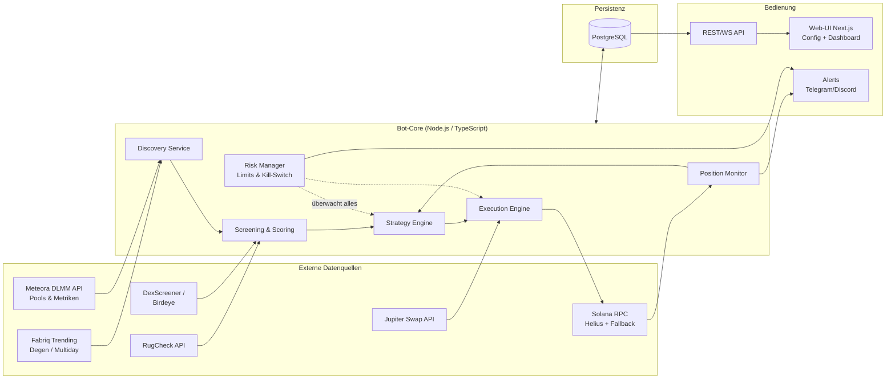
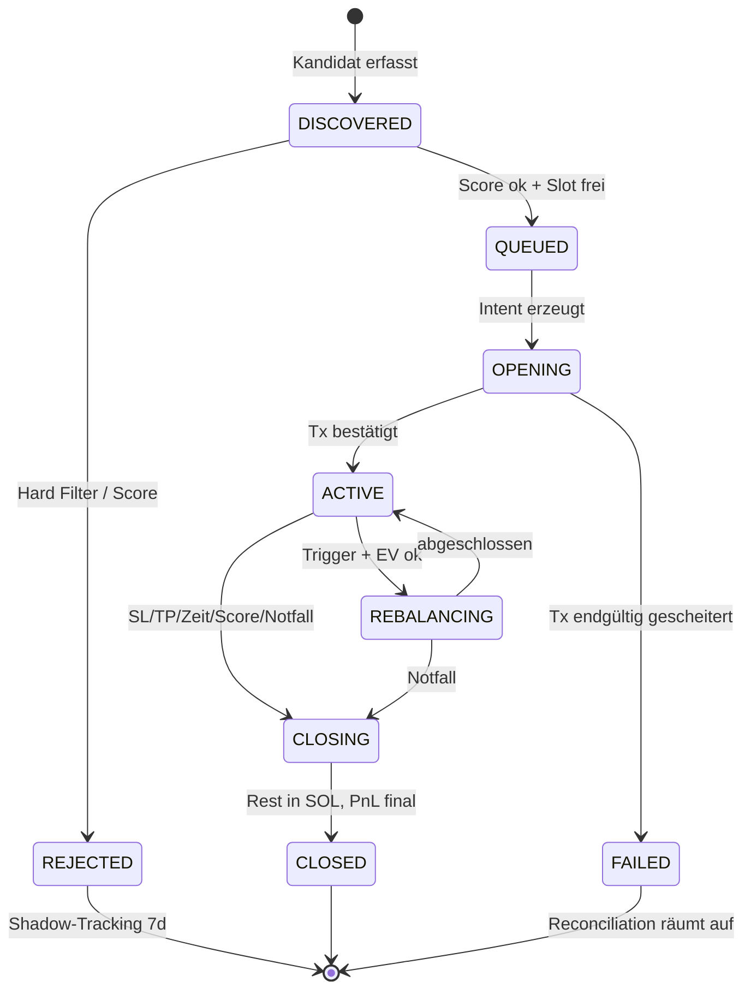

# Konzept: Automatisierter Meteora-DLMM-LP-Bot (Solana)

> Automatisiertes Liquidity Providing auf Meteora DLMM: Pool-Discovery über Fabriq
> (Presets **Degen** und **Multiday**), mehrstufige Filterung bösartiger/schlechter Pools,
> automatisches Eröffnen, Rebalancen und Schließen von Positionen, Web-UI zur
> Parametersteuerung sowie ein Analyse-Dashboard zur Effizienzmessung.

---

## 1. Ziele und Nicht-Ziele

**Ziele**

1. Kontinuierliche Entdeckung attraktiver DLMM-Pools (Quelle: Fabriq Trending, Kategorien Degen/Multiday, abgesichert über Meteora-Daten).
2. Systematisches Aussortieren von Rug-/Honeypot-/Wash-Trading-Pools **bevor** Kapital eingesetzt wird.
3. Vollautomatischer Positions-Lebenszyklus: Eröffnen → Überwachen → Fees claimen → Rebalancen → Schließen (inkl. Notausstieg).
4. Web-UI: alle Strategie- und Risikoparameter zur Laufzeit anpassbar, Kill-Switch, Positionsübersicht.
5. Analyse-Dashboard: PnL, Fee-Erträge, Impermanent Loss, Kostenaufschlüsselung, Filter-Trefferquote — pro Position, Pool und Preset.
6. Risikominimierung als durchgängiges Designprinzip (Kapital-Caps, Circuit Breaker, Paper-Trading-Modus, Schlüsselsicherheit).

**Nicht-Ziele (v1)**

- Kein Hebel, keine Derivate, kein Cross-Chain.
- Kein HFT/MEV-Searching — der Bot ist ein LP-Manager, kein Sniper.
- Keine DAMM-v2-Pools in v1 (Architektur lässt spätere Erweiterung zu).

**Grundhaltung:** Degen-LPing auf frische Memecoin-Pools ist strukturell hochriskant.
Das Konzept behandelt Totalverlust einzelner Positionen als *erwartbares* Ereignis und
steuert deshalb primär über Positionsgrößen, Limits und schnelle Exits — nicht über die
Illusion, jeden Rug erkennen zu können.

---

## 2. Fachlicher Hintergrund: Meteora DLMM in Kürze

Für Design-Entscheidungen relevante Eigenschaften des DLMM (Dynamic Liquidity Market Maker):

- **Bins:** Liquidität liegt in diskreten Preis-Bins. Nur der **aktive Bin** verdient Fees. Der Abstand zwischen Bins ist der **Bin Step** (in Basispunkten); Degen-Pools nutzen typischerweise große Bin Steps (100–400 bps), stabile Paare kleine (1–25 bps).
- **Dynamische Fees:** Basisgebühr + volatilitätsabhängige Zusatzgebühr. In volatilen Phasen steigen die LP-Erträge — genau dann ist aber auch das Verlustrisiko am höchsten.
- **Positionsform:** Beim Einzahlen wählt man eine Liquiditätsverteilung: `Spot` (gleichmäßig), `Curve` (um den aktiven Bin konzentriert), `BidAsk` (an den Rändern konzentriert). Einseitige Positionen sind möglich (nur SOL unterhalb des Preises = gestaffelte Kauforder, nur Token oberhalb = gestaffelte Verkaufsorder).
- **Kein Auto-Compounding:** Fees müssen aktiv geclaimt werden.
- **Standardposition ≈ 69 Bins** (erweiterbar); Range-Breite = Bins × Bin Step.
- **Impermanent Loss:** Läuft der Preis durch die Range, hält die Position am Ende nur noch den schwächeren Token. Bei Memecoins heißt das: Wer nicht rechtzeitig aussteigt, hält Bags eines toten Tokens. Fees kompensieren IL nur bei ausreichend Volumen und begrenztem Drawdown.

**SDK-Abdeckung** (`@meteora-ag/dlmm`, TypeScript, v1.9.x — verifiziert am Quellcode):

| Bedarf | SDK-Methode |
|---|---|
| Pool instanziieren | `DLMM.create(connection, poolAddress)` |
| Aktiven Bin/Preis lesen | `getActiveBin()`, `getBinsAroundActiveBin()` |
| Position eröffnen | `initializePositionAndAddLiquidityByStrategy()` (StrategyType `Spot`/`Curve`/`BidAsk`) |
| Liquidität nachlegen | `addLiquidityByStrategy()` |
| Fees claimen | `claimSwapFee()` / `claimAllSwapFee()` / `claimAllRewards()` |
| Liquidität abziehen | `removeLiquidity()` |
| Position schließen | `closePosition()` / `closePositionIfEmpty()` |
| Rebalance (nativ) | `simulateRebalancePosition()` + `rebalancePosition()` |
| Bestandsaufnahme | `DLMM.getAllLbPairPositionsByUser()` |
| Quotes/Swaps im Pool | `swapQuote()`, `swap()` |
| Fee-Zustand | `getFeeInfo()`, `getDynamicFee()` |

**Pool-Marktdaten:** Öffentliche Meteora-API (`dlmm-api.meteora.ag`, neuere Variante `dlmm.datapi.meteora.ag/pools`) liefert pro Pool u. a. `liquidity` (TVL), `trade_volume_24h`, `fees_24h`, `apr/apy`, `bin_step`, `base_fee_percentage`, `current_price` sowie stundenbasierte Fee/TVL-Fenster — Grundlage für eigenes Scoring und Fabriq-Abgleich.

---

## 3. Gesamtarchitektur

### 3.1 Komponentenübersicht



### 3.2 Tech-Stack

| Schicht | Wahl | Begründung |
|---|---|---|
| Sprache/Runtime | TypeScript auf Node.js 20+ | Offizielles DLMM-SDK ist TS; ein Ökosystem für Bot + UI |
| Solana | `@solana/web3.js`, `@meteora-ag/dlmm`, Jupiter Swap API | Offizielle/etablierte Bausteine |
| RPC | Helius (Primär) + zweiter Anbieter (Fallback), eigene Priority-Fee-Schätzung | Zuverlässige Tx-Landung ist kritisch |
| Persistenz | PostgreSQL (Prisma ORM) | Relationale Auswertbarkeit für Analytics; ein einziges zusätzliches System |
| Jobs/Scheduling | In-Process-Scheduler + BullMQ (Redis) nur falls nötig | So wenig Infrastruktur wie möglich |
| UI | Next.js + tRPC/REST + WebSocket, Recharts | Schnelle Entwicklung, Live-Updates |
| Deployment | Docker Compose auf VPS; `.env` für Secrets | Reproduzierbar, einfach |
| Alerting | Telegram-Bot (kritisch + täglicher Report) | Sofortige Reaktionsfähigkeit |

### 3.3 Repo-Layout (Monorepo)

```
/apps
  /bot        # Core-Services (Discovery, Screening, Strategy, Execution, Monitor)
  /web        # Next.js UI (Config, Positionen, Dashboard)
/packages
  /core       # Domänenmodelle, Zustandsmaschine, Scoring, Risk-Regeln (pure, testbar)
  /adapters   # Fabriq, Meteora-API, RugCheck, DexScreener, Jupiter, RPC
  /db         # Prisma-Schema + Migrationen
/config       # Preset-Defaults (degen.json, multiday.json), zod-validiert
```

Kernprinzip: **Alle Entscheidungslogik (Scoring, Strategie, Risk) ist pure und ohne
Netzwerk/Chain testbar**; Adapter und Execution sind dünne, austauschbare Schalen.
Dadurch sind Backtests und Paper-Trading mit identischem Code möglich.

---

## 4. Pool-Discovery (Fabriq + Meteora)

### 4.1 Quellenstrategie

**Fabriq** (fabriq.trade/trending) ist die gewünschte primäre Discovery-Quelle mit den
Kategorien **Degen** (frische, hochaktive Pools, kurzer Horizont) und **Multiday**
(Pools/Token mit mehrtägiger Bestandskraft) sowie einem Aktivitäts-Score
(Community-Faustregel: Score > 200 = hohe Aktivität). **Fabriq hat jedoch keine
dokumentierte öffentliche API.** Daraus folgt eine Zwei-Wege-Strategie:

1. **Fabriq-Adapter (bevorzugt, wenn stabil machbar):** Die interne JSON-API der
   Trending-Seite wird per Browser-DevTools identifiziert und in einem isolierten
   Adapter gekapselt (eigenes Modul, defensives Parsing, Schema-Validierung mit zod,
   Rate-Limit ≤ 1 Request/30 s, User-Agent-Kennzeichnung). Risiken werden explizit
   akzeptiert und behandelt: Die API kann sich jederzeit ändern oder wegfallen
   (→ Health-Check + Alert + automatischer Fallback), und die Nutzungsbedingungen von
   Fabriq sind vorab zu prüfen.
2. **Fallback/Parallel: Eigene Preset-Replikation.** Aus der Meteora-API +
   DexScreener-Daten werden die beiden Kategorien nachgebildet, sodass der Bot **nie**
   hart von Fabriq abhängt:
   - *Degen-Kandidaten:* Pool-/Token-Alter < 48 h, hohes `volume_1h`/TVL-Verhältnis,
     Fee/TVL-Rate (1h/24h) über Schwellwert, Bin Step ≥ 100, Basisgebühr ≥ 1 %.
   - *Multiday-Kandidaten:* Token-Alter > 3–7 Tage, Volumen an ≥ 3 aufeinanderfolgenden
     Tagen über Schwellwert, TVL stabil/steigend, Fee/TVL 24h attraktiv, Holder-Anzahl
     wachsend.

Beide Quellen speisen dieselbe Kandidaten-Pipeline; jeder Kandidat trägt seine Herkunft
(`source: fabriq_degen | fabriq_multiday | replicated_degen | replicated_multiday`) —
das Dashboard weist später aus, welche Quelle die besseren Positionen liefert.

### 4.2 Ablauf

- Poll-Zyklus: Degen alle 60 s, Multiday alle 10 min (konfigurierbar).
- Dedupe gegen: bereits aktive Positionen, Blacklist, kürzlich geprüfte Kandidaten (Cooldown).
- Jeder neue Kandidat wird als `PoolCandidate` mit Roh-Metriken persistiert und an das Screening übergeben — auch wenn er später abgelehnt wird (wichtig für Filter-Kalibrierung, siehe 5.5).

---

## 5. Screening & Scoring: schlechte/bösartige Pools herausfiltern

Zweistufig: **Hard Filters** (K.o.-Kriterien, billig zuerst) → **Score** (0–100,
Ranking + Mindestscore pro Preset). Datenquellen: RugCheck-API (Token-Risiko-Report),
DexScreener/Birdeye (Markt-Querschnitt), eigene On-Chain-Reads (Wahrheit letzter Instanz),
Jupiter (Ausführbarkeits-Check).

### 5.1 Hard Filters — Token-Sicherheit (K.o.)

| Prüfung | Regel | Quelle |
|---|---|---|
| Mint Authority | muss revoked sein | On-Chain (Mint-Account) |
| Freeze Authority | muss revoked sein (sonst einfrierbare Wallets = Honeypot-Vektor) | On-Chain |
| Token-2022-Extensions | Transfer Fee > 0, Transfer Hook, Permanent Delegate, nicht-transferierbar → Ablehnung | On-Chain |
| Verkaufbarkeit (Honeypot-Test) | Jupiter-Quote in **beide** Richtungen (SOL→Token und Token→SOL) muss mit plausiblem Preis­impact möglich sein | Jupiter |
| RugCheck-Report | normalisierter Risk-Score über Schwellwert bzw. kritische Flags (z. B. „Freeze Authority", „Single holder ownership") → Ablehnung | RugCheck |
| Metadaten | mutable Metadata nur als Score-Malus, nicht K.o. (zu viele False Positives) | RugCheck/On-Chain |

### 5.2 Hard Filters — Holder & Verteilung

| Prüfung | Degen-Default | Multiday-Default |
|---|---|---|
| Top-10-Holder-Anteil (ohne LP/Burn-Adressen) | < 30 % | < 25 % |
| Größter Einzel-Holder | < 10 % | < 8 % |
| Insider-/Bundler-Anteil (RugCheck) | < 20 % | < 10 % |
| Holder-Anzahl | ≥ 250 | ≥ 1000 |
| Dev-Wallet-Verhalten | kein aktives Abverkaufen erkennbar | dito |

### 5.3 Hard Filters — Markt- & Pool-Qualität

| Prüfung | Zweck |
|---|---|
| TVL ≥ Minimum (Degen: 50 k$, Multiday: 150 k$) | Exit-Fähigkeit |
| Eigene Positionsgröße ≤ x % des Pool-TVL (Default 1 %) | eigener Preis-/Exit-Impact |
| Volumen-Plausibilität: `vol24h/TVL` innerhalb [Preset-Min, Obergrenze ~50] | zu niedrig = tot, absurd hoch = Wash-Trading-Verdacht |
| Wash-Trading-Heuristik: Trades-Anzahl vs. Volumen, Anteil Top-Trader-Wallets, Volumen gleichmäßig statt in Bursts weniger Wallets | Fake-Aktivität erkennen |
| Preis-Konsistenz: Pool-Preis vs. Jupiter-Aggregatorpreis, Abweichung < 2 % | manipulierte/illiquide Pools |
| Quote-Token = SOL (v1: nur X/SOL-Pools) | ein Bewertungs- und Exit-Asset |
| Pool nicht von einer einzigen LP-Wallet dominiert (> 80 %) | plötzlicher Liquiditätsabzug Dritter |
| Token-Alter im Preset-Fenster (Degen: 1 h–48 h; Multiday: ≥ 72 h) | Preset-Definition |

### 5.4 Score (0–100) für das Ranking der Überlebenden

Gewichtete Summe, Startgewichte (per Paper-Trading zu kalibrieren):

- **35 % Fee-Ertragskraft:** Fee/TVL-Rate (1 h, 24 h), Dynamik der letzten Stunden.
- **25 % Markt-Qualität:** Volumen-Stetigkeit, Trades/Volumen-Verhältnis, Holder-Wachstum.
- **20 % Sicherheitsmarge:** RugCheck-Score-Abstand zum Schwellwert, Holder-Verteilung, LP-Struktur.
- **10 % Momentum/Trend:** Preis- und Volumentrend (Multiday: Stetigkeit statt Spike).
- **10 % Quellen-Bonus:** Fabriq-Score/Ranking (sofern verfügbar), Übereinstimmung beider Quellen.

Einstieg nur bei Score ≥ Preset-Mindestscore **und** freiem Positäts-Slot; bei mehreren
Kandidaten gewinnt der höchste Score.

### 5.5 Filter-Kalibrierung durch Shadow-Tracking

Jeder **abgelehnte** Kandidat wird 7 Tage weiterverfolgt (Preis, TVL, Rug-Ereignis).
Das Dashboard zeigt daraus: False-Positive-Quote (zu Unrecht blockiert und gut gelaufen)
und False-Negative-Quote (durchgelassen und gerugged). Damit werden Schwellwerte
datengetrieben statt gefühlt nachjustiert.

---

## 6. Strategy Engine: Presets Degen & Multiday

Ein Preset bündelt Discovery-Fenster, Filter-Schwellen, Einstiegsform, Range-Design,
Rebalance- und Exit-Regeln. Beide Presets laufen parallel mit getrennten Kapitaltöpfen.

### 6.1 Preset „Degen" (Stunden-Horizont)

- **Kapital:** eigener Topf, z. B. 30 % des Bot-Kapitals; Positionsgröße 0,5–1 % des Gesamtkapitals, hartes Cap in SOL.
- **Einstieg:** **einseitig SOL** unterhalb des aktiven Bins (BidAsk-Verteilung, Konzentration nahe am aktiven Bin), Range ~20–40 Bins. Logik: Fees verdienen, sobald der Preis in die Range handelt; Token-Exposure entsteht nur durch echte Fills („DCA in the dip"), kein sofortiger 50/50-Kauf eines Degen-Tokens.
- **Fee-Claim:** alle 30 min oder ab Schwellwert; geclaimte Token-Fees sofort in SOL swappen (Gewinnsicherung).
- **Exit:** Stop-Loss −15 % Positionswert (in SOL), Take-Profit-Ziel, Max-Haltezeit 12–24 h, Notausstieg bei Rug-Signalen (Abschnitt 9).
- **Kein klassisches Recentering nach oben:** Läuft der Preis über die Range (Position vollständig in SOL + Fees realisiert), wird die Position geschlossen und der Pool neu bewertet — nachjagen ist ein bewusster, separater Entscheid der Engine, kein Automatismus.

### 6.2 Preset „Multiday" (Tage-Horizont)

- **Kapital:** z. B. 70 % des Bot-Kapitals; Positionsgröße 2–4 %, Cap in SOL.
- **Einstieg:** 50/50 um den aktiven Bin, `Curve`-Verteilung, volle Standardbreite (~69 Bins). 50 % werden via Jupiter in den Token geswappt (Slippage-Cap, Preis-Impact-Check).
- **Fee-Claim:** alle 4–6 h; Token-Anteil der Fees wird zu 50/50 rebalanced oder in SOL gesichert (Parameter).
- **Rebalancing:** aktiv (Abschnitt 8).
- **Exit:** Stop-Loss −25 % (in SOL), Zeitlimit 7–14 Tage, Verschlechterung der Pool-Qualität (Score-Verfall unter Exit-Schwelle, TVL-Abfluss > 50 %) → geordneter Ausstieg.

### 6.3 Portfolio-Constraints (Risk Manager, global)

- Max. gleichzeitige Positionen (Default: 5 Degen, 5 Multiday).
- Max. Gesamt-Exposure in SOL; Mindest-SOL-Reserve für Gebühren/Exits (nie < 0,5 SOL).
- Max. 1 Position pro Token-Mint; Korrelationslimit: max. n neue Degen-Entries pro Stunde.
- **Circuit Breaker:** Tagesverlustlimit (z. B. −5 % des Bot-Kapitals) → keine neuen Entries für 24 h; zweiter Schwellwert (−10 %) → alles schließen + Kill-Switch + Alert.

---

## 7. Execution Engine

Zuständig für jede Chain-Interaktion; Strategy Engine gibt nur Intents („öffne Position
X mit Parametern Y").

- **Tx-Pipeline:** bauen → `simulateTransaction` (Pflicht) → Priority Fee dynamisch (Helius-Schätzung, Cap) → senden → Bestätigung mit Timeout → bei Expiry idempotent neu versuchen (Blockhash-Erneuerung, max. n Versuche, exponentieller Backoff).
- **Swaps** (Entry-Vorbereitung, Fee-Konvertierung, Exit-Reste) via Jupiter mit hartem Slippage-Cap (Degen 3 %, Multiday 1 %) und Preis-Impact-Check; optional Versand als Jito-Bundle gegen Sandwiching.
- **Idempotenz & Crash-Sicherheit:** Jeder Intent hat eine ID und wird vor dem Senden persistiert; nach Neustart werden On-Chain-Zustand (`getAllLbPairPositionsByUser`) und DB abgeglichen (Reconciliation) — verwaiste On-Chain-Positionen werden adoptiert, halb ausgeführte Intents aufgeräumt.
- **RPC-Failover:** Health-Check beider Endpunkte; bei Primärausfall automatischer Wechsel + Alert.
- **Kostenerfassung:** Jede Tx protokolliert Priority Fee, Signatur-Fee, Swap-Fee und Preis-Impact → fließt in Netto-PnL.

---

## 8. Positions-Monitoring & Rebalancing

### 8.1 Monitoring

- Pro aktiver Position: aktiver Bin, Position-vs-Range-Lage, unclaimed Fees, Positionswert in SOL (mark-to-market via Jupiter), Pool-TVL/Volumen-Deltas.
- Frequenz: Degen 15–30 s, Multiday 60 s; zusätzlich Account-Subscription über WebSocket wo möglich.
- Abgeleitete Größen: Time-in-Range, realisierte Fee-APR, Drawdown seit Entry.

### 8.2 Rebalance-Regeln (primär Multiday)

- **Trigger:** aktiver Bin verlässt die inneren 80 % der Range (Puffer-Parameter) oder ist ≥ x Bins vom Zentrum entfernt.
- **Hysterese:** Mindestabstand zwischen Rebalances (Default 2 h), max. Rebalances pro Position/Tag (Default 4) — verhindert Zappeln in Seitwärts-Chops.
- **EV-Check vor jedem Rebalance:** geschätzte zusätzliche Fee-Einnahme (aus aktueller Fee-Rate × Restlaufzeit) muss die Rebalance-Kosten (Swap-Fee + Preis-Impact + Priority Fees) um Faktor ≥ 2 übersteigen, sonst warten oder Exit prüfen.
- **Ablauf:** Fees claimen → `simulateRebalancePosition()` → wenn ok: `rebalancePosition()` (nativer SDK-Pfad); Fallback klassisch: remove → swap auf Zielverhältnis → re-add. Danach neue Range um aktiven Bin.
- **Richtungs-Asymmetrie:** Rebalance nach unten (Preis fällt) ist zugleich ein Stop-Loss-Check — bei Abwärts-Rebalance wird zuerst die Exit-Logik (Abschnitt 9) ausgewertet; nie „in den fallenden Preis" nachzentrieren, wenn SL-Nähe besteht.
- **Degen-Positionen rebalancen nicht** — sie werden geschlossen und ggf. neu eröffnet (einfacher, weniger Fehlerpfade, klare PnL-Attribution).

---

## 9. Exits, Notfall-Logik, Kill-Switch

**Geordneter Exit** (SL/TP/Zeit/Score-Verfall): Fees claimen → `removeLiquidity` (100 %) → `closePosition` → Token-Rest via Jupiter in SOL (Slippage-Cap; bei Nichtausführbarkeit: Teilverkäufe/TWAP über n Minuten) → PnL festschreiben → Pool-Cooldown.

**Notausstieg (Rug-Trigger), höchste Priorität, überspringt EV-Checks:**

| Signal | Schwelle (Default) |
|---|---|
| Preissturz | > 30 % in 5 min |
| TVL-Abzug | > 40 % in 10 min |
| Verkaufbarkeit weg | Jupiter-Quote Token→SOL schlägt fehl oder Impact > 25 % |
| Autoritäten-Änderung | neue Freeze-/Mint-Authority-Aktivität, Token-Account-Freeze beobachtet |
| Dev-/Top-Holder-Dump | bekannter Insider verkauft > x % |

Ablauf Notausstieg: sofort `removeLiquidity` mit hoher Priority Fee → alles in SOL
(hoher Slippage-Toleranz-Notmodus) → Token + Deployer auf **permanente Blacklist** →
Alert. Misslingt der Token-Verkauf (Honeypot nachträglich), wird der Verlust realisiert
protokolliert — kein wiederholtes Anrennen.

**Kill-Switch (UI + Telegram-Kommando):** Stufe 1 „Pause" = keine neuen
Entries/Rebalances, Monitoring läuft. Stufe 2 „Flatten" = alle Positionen geordnet
schließen, alles in SOL.

---

## 10. Zustandsmaschine & Datenmodell

### 10.1 Position-Lifecycle



Jeder Übergang wird mit Zeitstempel, Auslöser und Kontext in einem **Event-Log**
persistiert (Audit-Trail = Datenbasis des Dashboards).

### 10.2 Kerntabellen (PostgreSQL)

- `pool_candidates` — entdeckte Pools, Quelle, Roh-Metriken, Filter-Ergebnis (inkl. welcher Filter abgelehnt hat), Score, Shadow-Tracking-Verlauf.
- `positions` — Zustand, Preset, Pool, Range (min/max Bin), Einsatz, aktueller Wert, Realized/Unrealized PnL.
- `position_events` — Zustandsübergänge + Auslöser.
- `transactions` — Signatur, Typ (open/claim/rebalance/close/swap), Status, alle Kosten.
- `fee_claims` — Claim-Beträge je Token, SOL-Bewertung zum Claim-Zeitpunkt.
- `pool_snapshots` — Zeitreihe TVL/Volumen/Fee-Rate/Preis für aktive + geschattete Pools.
- `config_versions` — jede Parameteränderung versioniert (wer/wann/was) → Performance ist Konfigurationsständen zuordenbar.
- `blacklist` — Mints, Deployer, Pools; mit Grund.

---

## 11. UI & Analyse-Dashboard

Self-hosted Next.js-App, Zugriff nur via Login/Token (kein öffentliches Interface).

### 11.1 Seiten

1. **Übersicht:** Bot-Status, Kapital & Exposure je Preset, offene Positionen live (Wert, PnL, Time-in-Range, nächste Aktion), Kill-Switch-Buttons (Pause/Flatten).
2. **Scanner:** aktuelle Kandidaten mit Score-Breakdown und Filter-Ergebnissen („warum abgelehnt") — macht das Screening transparent und debugbar.
3. **Parameter:** alle Preset- und Risiko-Parameter (Abschnitt 14) editierbar; zod-Validierung, Vorschau der Auswirkung (z. B. „TVL-Filter würde aktuell n Pools zulassen"), Versionierung, Anwenden ohne Neustart (Config-Service mit Hot-Reload). Sicherheitskritische Limits (Caps, Circuit Breaker) erfordern Bestätigung.
4. **Analyse-Dashboard** (Effizienz des Bots):
   - **PnL:** kumuliert & pro Tag, netto nach allen Kosten; Aufriss nach Preset, Pool, Quelle (Fabriq vs. Replikation).
   - **Ertragsqualität:** realisierte Fee-APR vs. IL je Position; PnL vs. „HODL-Benchmark" (was wäre der Einsatz wert, hätte man nur gehalten).
   - **Kosten:** Priority Fees, Swap-Fees, Preis-Impact, Rebalance-Kosten — absolut und als % vom Ertrag.
   - **Trefferquoten:** Win-Rate, Verteilung der Positions-PnLs, Max Drawdown, Profit Factor.
   - **Filter-Güte:** Rug-Rate durchgelassener vs. geblockter Pools (Shadow-Tracking), False-Positive-/False-Negative-Trend.
   - **Betrieb:** Tx-Erfolgsquote, Bestätigungszeiten, RPC-Failover, Fehlerrate.
5. **Positions-Detail:** vollständige Historie (Events, Txs, Claims, Chart der Range vs. Preis).

### 11.2 Live-Updates

WebSocket-Push vom Bot (Positionswerte, neue Kandidaten, Alerts); Charts mit Recharts;
Tabellen mit Server-Pagination aus PostgreSQL.

---

## 12. Risikominimierung — Gesamtsicht

| Risiko | Gegenmaßnahmen |
|---|---|
| **Rug Pull / Honeypot** | Hard Filters (Abschnitt 5), Verkaufbarkeits-Simulation, Rug-Trigger-Notausstieg, permanente Blacklist, kleine Degen-Positionsgrößen als Grundannahme „Rug passiert trotzdem" |
| **Impermanent Loss / Preisverfall** | Einseitige SOL-Entries (Degen), Stop-Loss in SOL-Terms, Max-Haltezeit, Fee-Gewinne laufend in SOL sichern, EV-Check vor Rebalance statt blindem Nachzentrieren |
| **Wash-Trading-Fallen** (Fake-Volumen lockt LPs) | Volumen-Plausibilitäts-Heuristiken, Trades/Wallet-Verteilung, Fee-Ertrag real messen und Position bei Ausbleiben schließen |
| **Klumpenrisiko** | Caps pro Position/Token/Preset, max. gleichzeitige Positionen, Entry-Rate-Limit |
| **Kaskadenverluste** | Tagesverlust-Circuit-Breaker (2 Stufen), Kill-Switch, Cooldowns nach Verlusten |
| **Ausführungsrisiko** (Slippage, Sandwiching, Tx-Fails) | Pflicht-Simulation, Slippage-Caps, Jito-Option, Priority-Fee-Steuerung mit Cap, Retries mit Idempotenz |
| **Infrastrukturausfall** (RPC, Bot-Crash, Fabriq-API weg) | RPC-Failover, Reconciliation beim Start, Watchdog/Heartbeat + Alert, Fabriq-Fallback auf eigene Replikation; Positionen sind on-chain auch bei Bot-Ausfall sicher (kein Verlust durch Downtime, nur entgangene Reaktion) |
| **Schlüssel-/Betriebssicherheit** | Dedizierte Hot-Wallet nur mit Arbeitskapital; Gewinne regelmäßig automatisch an Cold-Wallet ausschütten (Sweep-Job); Key verschlüsselt (age/KMS), nie im Repo; Server gehärtet; UI nur mit Auth |
| **Parameter-Fehlbedienung** | Validierung + Plausibilitätsgrenzen in der UI, Config-Versionierung, sicherheitskritische Änderungen mit Bestätigung |
| **Modell-Selbstbetrug** | Paper-Trading-Modus mit identischem Codepfad, Shadow-Tracking, Go/No-Go-Kriterien vor jeder Ausbaustufe (Abschnitt 13) |

Ausdrückliche Restrisiken: Smart-Contract-Risiko (Meteora selbst), Solana-Netzwerk­degradation,
sowie Rugs, die alle Filter passieren. Diese sind nicht eliminierbar — nur durch
Positionsgrößen und Diversifikation begrenzbar. Es wird nur Kapital eingesetzt, dessen
Totalverlust tragbar ist.

---

## 13. Test- und Rollout-Plan

**Teststrategie**

- Unit-Tests für Scoring, Filter, Strategie- und Risk-Regeln (pure Funktionen, Fixtures aus echten API-Antworten).
- Integrationstests der Adapter gegen aufgezeichnete Responses; Tx-Bau gegen `simulateTransaction`.
- Fehlerinjektion: RPC-Ausfall, Tx-Timeout, halbfertige Intents → Reconciliation muss deterministisch aufräumen.

**Rollout in Phasen mit Go/No-Go-Kriterien**

| Phase | Inhalt | Go-Kriterium für nächste Phase |
|---|---|---|
| 1. Beobachten (1–2 Wo.) | Discovery + Screening + Dashboard live, **Paper-Trading** (simulierte Positionen auf echten Marktdaten inkl. simulierter Kosten) | Filter-Rug-Rate im Rahmen, Paper-PnL positiv über ≥ 2 Wochen, keine Pipeline-Bugs |
| 2. Klein & manuell (1–2 Wo.) | Echte Positionen mit Mikro-Caps (z. B. max. 0,5 SOL/Position), Entries erfordern 1-Klick-Freigabe in der UI | Tx-Erfolgsquote > 95 %, Ist-Kosten ≈ simulierte Kosten, Notausstieg 1× erfolgreich getestet |
| 3. Vollautomatik klein | Auto-Entries beide Presets, Rebalancing aktiv, Circuit Breaker scharf | 4 Wochen netto-positiv nach Kosten, Drawdown < Limit |
| 4. Skalierung & Tuning | Caps schrittweise erhöhen, Parameter datengetrieben nachziehen (Dashboard/Shadow-Tracking), optional: Backtesting-Modul auf gesammelten `pool_snapshots` | fortlaufend |

---

## 14. Parameter-Referenz (UI-editierbar, Startwerte)

**Global:** `maxTotalExposureSOL`, `minSolReserve` (0,5), `maxOpenPositions` (10),
`dailyLossLimitPct` (5), `hardLossLimitPct` (10), `killSwitch` (pause/flatten),
`priorityFeeCapLamports`, `rpcPrimary/rpcFallback`, `paperTrading` (default **on**),
`profitSweepThresholdSOL` → Cold-Wallet.

**Pro Preset (Degen / Multiday):** Kapitalanteil (30 / 70 %), `positionSizePct`
(1 / 3), `maxPositions` (5 / 5), `minScore` (65 / 60), `minTvlUsd` (50 k / 150 k),
`tokenAgeWindow` (1–48 h / ≥ 72 h), `volTvlBounds`, `strategyType` (BidAsk einseitig /
Curve 50-50), `binRange` (20–40 / ~69), `feeClaimInterval` (30 min / 4 h),
`convertFeesToSol` (true / 50 %), `stopLossPct` (15 / 25), `takeProfitPct`,
`maxHoldHours` (24 / 336), `rebalance.enabled` (false / true), `rebalance.bufferPct`,
`rebalance.cooldownMin` (– / 120), `rebalance.maxPerDay` (– / 4), `rebalance.minEvFactor`
(– / 2), `slippageCapPct` (3 / 1), Notfall-Trigger-Schwellen (Abschnitt 9).

---

## 15. Offene Entscheidungen & nächste Schritte

**Zu klären (blockiert Phase 1 nicht):**

1. Fabriq: interne API identifizieren, Stabilität/ToS bewerten → Entscheidung Adapter vs. nur Replikation.
2. RugCheck-Rate-Limits/API-Key-Bedarf prüfen; ggf. Birdeye-Paid-Tier als zweite Quelle.
3. Jito-Bundles ab Phase 2 oder 3.
4. Devnet-Probelauf der Execution-Pfade vs. direkt Mainnet-Mikrobeträge (Empfehlung: beides, Devnet nur für Tx-Mechanik).

**Umsetzungsreihenfolge (Vorschlag):**

1. Monorepo-Gerüst + DB-Schema + Config-Service (zod, Versionierung).
2. Adapter: Meteora-API, DexScreener, RugCheck, Jupiter-Quote; Fabriq-Spike.
3. Screening/Scoring + Scanner-UI + Shadow-Tracking (liefert sofort Nutzwert).
4. Paper-Trading-Engine (Positions-Simulation auf Live-Daten) + Dashboard-Basis.
5. Execution Engine + Reconciliation + Telegram-Alerts.
6. Live-Phasen 2–4 gemäß Rollout-Plan.

---

*Hinweis: Dieses Konzept dokumentiert ein Hochrisiko-Handelssystem für eigene Mittel.
Alle Startwerte sind bewusst konservativ und werden ausschließlich datengetrieben
(Paper-Trading, Shadow-Tracking, Dashboard) gelockert.*
