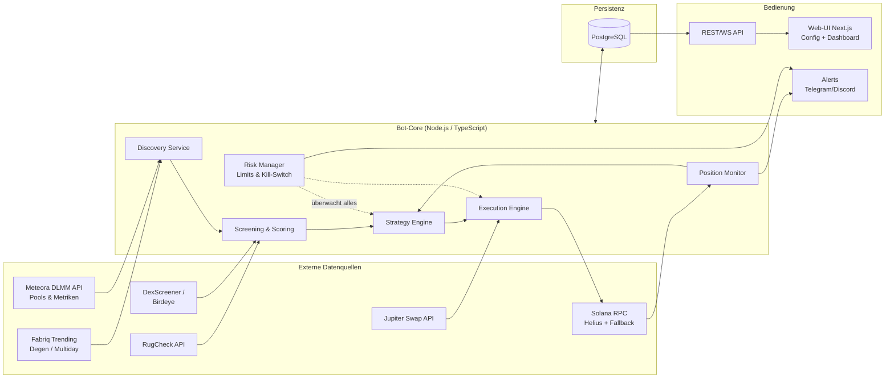
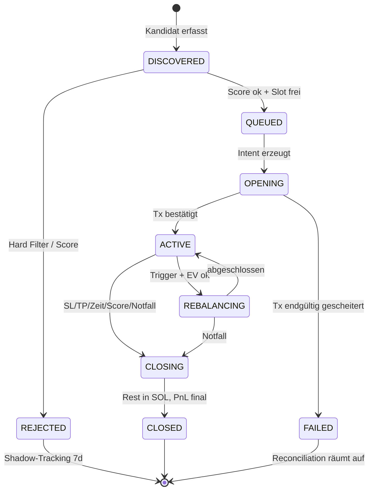

# Konzept: Automatisierter Meteora-DLMM-LP-Bot (Solana)

> Automatisiertes Liquidity Providing auf Meteora DLMM: Pool-Discovery über Fabriq
> (Presets **Degen** und **Multiday**), mehrstufige Filterung bösartiger/schlechter Pools,
> automatisches Eröffnen, Rebalancen und Schließen von Positionen, Web-UI zur
> Parametersteuerung sowie ein Analyse-Dashboard zur Effizienzmessung.

---

## 1. Ziele und Nicht-Ziele

**Ziele**

1. Kontinuierliche Entdeckung attraktiver DLMM-Pools (Quelle: Fabriq Trending, Kategorien Degen/Multiday, abgesichert über Meteora-Daten).
2. Systematisches Aussortieren von Rug-/Honeypot-/Wash-Trading-Pools **bevor** Kapital eingesetzt wird.
3. Vollautomatischer Positions-Lebenszyklus: Eröffnen → Überwachen → Fees claimen → Rebalancen → Schließen (inkl. Notausstieg).
4. Web-UI: alle Strategie- und Risikoparameter zur Laufzeit anpassbar, Kill-Switch, Positionsübersicht.
5. Analyse-Dashboard: PnL, Fee-Erträge, Impermanent Loss, Kostenaufschlüsselung, Filter-Trefferquote — pro Position, Pool und Preset.
6. Risikominimierung als durchgängiges Designprinzip (Kapital-Caps, Circuit Breaker, Paper-Trading-Modus, Schlüsselsicherheit).

**Nicht-Ziele (v1)**

- Kein Hebel, keine Derivate, kein Cross-Chain.
- Kein HFT/MEV-Searching — der Bot ist ein LP-Manager, kein Sniper.
- Keine DAMM-v2-Pools in v1 (Architektur lässt spätere Erweiterung zu).

**Grundhaltung:** Degen-LPing auf frische Memecoin-Pools ist strukturell hochriskant.
Das Konzept behandelt Totalverlust einzelner Positionen als *erwartbares* Ereignis und
steuert deshalb primär über Positionsgrößen, Limits und schnelle Exits — nicht über die
Illusion, jeden Rug erkennen zu können.

---

## 2. Fachlicher Hintergrund: Meteora DLMM in Kürze

Für Design-Entscheidungen relevante Eigenschaften des DLMM (Dynamic Liquidity Market Maker):

- **Bins:** Liquidität liegt in diskreten Preis-Bins. Nur der **aktive Bin** verdient Fees. Der Abstand zwischen Bins ist der **Bin Step** (in Basispunkten); Degen-Pools nutzen typischerweise große Bin Steps (100–400 bps), stabile Paare kleine (1–25 bps).
- **Dynamische Fees:** Basisgebühr + volatilitätsabhängige Zusatzgebühr. In volatilen Phasen steigen die LP-Erträge — genau dann ist aber auch das Verlustrisiko am höchsten.
- **Positionsform:** Beim Einzahlen wählt man eine Liquiditätsverteilung: `Spot` (gleichmäßig), `Curve` (um den aktiven Bin konzentriert), `BidAsk` (an den Rändern konzentriert). Einseitige Positionen sind möglich (nur SOL unterhalb des Preises = gestaffelte Kauforder, nur Token oberhalb = gestaffelte Verkaufsorder).
- **Kein Auto-Compounding:** Fees müssen aktiv geclaimt werden.
- **Standardposition ≈ 69 Bins** (erweiterbar); Range-Breite = Bins × Bin Step.
- **Impermanent Loss:** Läuft der Preis durch die Range, hält die Position am Ende nur noch den schwächeren Token. Bei Memecoins heißt das: Wer nicht rechtzeitig aussteigt, hält Bags eines toten Tokens. Fees kompensieren IL nur bei ausreichend Volumen und begrenztem Drawdown.

**SDK-Abdeckung** (`@meteora-ag/dlmm`, TypeScript, v1.9.x — verifiziert am Quellcode):

| Bedarf | SDK-Methode |
|---|---|
| Pool instanziieren | `DLMM.create(connection, poolAddress)` |
| Aktiven Bin/Preis lesen | `getActiveBin()`, `getBinsAroundActiveBin()` |
| Position eröffnen | `initializePositionAndAddLiquidityByStrategy()` (StrategyType `Spot`/`Curve`/`BidAsk`) |
| Liquidität nachlegen | `addLiquidityByStrategy()` |
| Fees claimen | `claimSwapFee()` / `claimAllSwapFee()` / `claimAllRewards()` |
| Liquidität abziehen | `removeLiquidity()` |
| Position schließen | `closePosition()` / `closePositionIfEmpty()` |
| Rebalance (nativ) | `simulateRebalancePosition()` + `rebalancePosition()` |
| Bestandsaufnahme | `DLMM.getAllLbPairPositionsByUser()` |
| Quotes/Swaps im Pool | `swapQuote()`, `swap()` |
| Fee-Zustand | `getFeeInfo()`, `getDynamicFee()` |

**Pool-Marktdaten:** Öffentliche Meteora-API (`dlmm.datapi.meteora.ag`, ältere
Variante `dlmm-api.meteora.ag`) liefert pro Pool u. a. `tvl`, Volumen und
Gebühren je Zeitfenster (30 m…24 h), `apr/apy`, `bin_step`, `base_fee_pct`,
`dynamic_fee_pct`, `protocol_fee_pct`, `collect_fee_mode` und `current_price` —
Grundlage für eigenes Scoring. Dokumentiertes Limit: **30 Anfragen/s**.

Drei Eigenschaften der Schnittstelle prägen die Umsetzung:

| Fähigkeit | Wozu genutzt |
|---|---|
| `sort_by=<metrik>_<fenster>:<richtung>` | mehrere Sortierungen zusammenführen, damit frische Pools überhaupt sichtbar werden (Abschnitt 4.1) |
| `filter_by=pool_address=[a\|b\|…]` | Sammelabruf: Messpunkte für alle verfolgten Pools in ~50 statt 2.000 Anfragen |
| `/pools/{address}/ohlcv` und `/volume/history` | **rückwirkender** Preis-, Volumen- und Gebührenverlauf bis auf 5-Minuten-Kerzen (siehe KONZEPT-ML.md 3.3) |

Der letzte Punkt hat Konsequenzen weit über die Discovery hinaus: Ein Teil der
Zeitreihe, die die Optimierung braucht, ist nachholbar. TVL und SOL-Kurs sind es
nicht — die gibt es nur als Momentaufnahme.

---

## 3. Gesamtarchitektur

### 3.1 Komponentenübersicht



### 3.2 Tech-Stack

| Schicht | Wahl | Begründung |
|---|---|---|
| Sprache/Runtime | TypeScript auf Node.js 20+ | Offizielles DLMM-SDK ist TS; ein Ökosystem für Bot + UI |
| Solana | `@solana/web3.js`, `@meteora-ag/dlmm`, Jupiter Swap API | Offizielle/etablierte Bausteine |
| RPC | Helius (Primär) + zweiter Anbieter (Fallback), eigene Priority-Fee-Schätzung | Zuverlässige Tx-Landung ist kritisch |
| Persistenz | PostgreSQL (Prisma ORM) | Relationale Auswertbarkeit für Analytics; ein einziges zusätzliches System |
| Jobs/Scheduling | In-Process-Scheduler + BullMQ (Redis) nur falls nötig | So wenig Infrastruktur wie möglich |
| UI | Next.js + tRPC/REST + WebSocket, Recharts | Schnelle Entwicklung, Live-Updates |
| Deployment | Docker Compose auf VPS; `.env` für Secrets | Reproduzierbar, einfach |
| Alerting | Telegram-Bot (kritisch + täglicher Report) | Sofortige Reaktionsfähigkeit |

### 3.3 Repo-Layout (Monorepo)

```
/apps
  /bot        # Core-Services (Discovery, Screening, Strategy, Execution, Monitor)
  /web        # Next.js UI (Config, Positionen, Dashboard)
/packages
  /core       # Domänenmodelle, Zustandsmaschine, Scoring, Risk-Regeln (pure, testbar)
  /adapters   # Fabriq, Meteora-API, RugCheck, DexScreener, Jupiter, RPC
  /db         # Prisma-Schema + Migrationen
/config       # Preset-Defaults (degen.json, multiday.json), zod-validiert
```

Kernprinzip: **Alle Entscheidungslogik (Scoring, Strategie, Risk) ist pure und ohne
Netzwerk/Chain testbar**; Adapter und Execution sind dünne, austauschbare Schalen.
Dadurch sind Backtests und Paper-Trading mit identischem Code möglich.

---

## 4. Pool-Discovery (Fabriq + Meteora)

### 4.1 Quellenstrategie

**Fabriq** (fabriq.trade/trending) ist die gewünschte primäre Discovery-Quelle mit den
Kategorien **Degen** (frische, hochaktive Pools, kurzer Horizont) und **Multiday**
(Pools/Token mit mehrtägiger Bestandskraft) sowie einem Aktivitäts-Score
(Community-Faustregel: Score > 200 = hohe Aktivität). **Fabriq hat jedoch keine
dokumentierte öffentliche API.** Daraus folgt eine Zwei-Wege-Strategie:

1. **Fabriq-Adapter (bevorzugt, wenn stabil machbar):** Die interne JSON-API der
   Trending-Seite wird per Browser-DevTools identifiziert und in einem isolierten
   Adapter gekapselt (eigenes Modul, defensives Parsing, Schema-Validierung mit zod,
   Rate-Limit ≤ 1 Request/30 s, User-Agent-Kennzeichnung). Risiken werden explizit
   akzeptiert und behandelt: Die API kann sich jederzeit ändern oder wegfallen
   (→ Health-Check + Alert + automatischer Fallback), und die Nutzungsbedingungen von
   Fabriq sind vorab zu prüfen.
2. **Fallback/Parallel: Eigene Preset-Replikation.** Aus der Meteora-API +
   DexScreener-Daten werden die beiden Kategorien nachgebildet, sodass der Bot **nie**
   hart von Fabriq abhängt:
   - *Degen-Kandidaten:* Pool-/Token-Alter < 48 h, hohes `volume_1h`/TVL-Verhältnis,
     Fee/TVL-Rate (1h/24h) über Schwellwert, Bin Step ≥ 100, Basisgebühr ≥ 1 %.
   - *Multiday-Kandidaten:* Token-Alter > 3–7 Tage, Volumen an ≥ 3 aufeinanderfolgenden
     Tagen über Schwellwert, TVL stabil/steigend, Fee/TVL 24h attraktiv, Holder-Anzahl
     wachsend.

Beide Quellen speisen dieselbe Kandidaten-Pipeline; jeder Kandidat trägt seine Herkunft
(`source: fabriq_degen | fabriq_multiday | replicated_degen | replicated_multiday`) —
das Dashboard weist später aus, welche Quelle die besseren Positionen liefert.

> **Spike-Ergebnis (Juli 2026):** Die Trending-Seite liefert ihre Pool-Daten nicht
> über einfach abgreifbare XHR-JSON-Endpoints (sichtbar waren nur Tracking-Calls;
> Auslieferung vermutlich im Seitendokument oder per WebSocket). Ein Zugriff über
> Session-Cookies wurde bewertet und verworfen: regelmäßige manuelle Token-Erneuerung,
> Kontozugangs-Schlüssel im Klartext auf dem Server, ToS-Risiko. **Entscheidung:
> Weg 2 (eigene Replikation) ist die primäre Discovery-Quelle.** Der defensive
> Fabriq-Adapter bleibt im Code und kann jederzeit aktiviert werden, falls ein
> stabiler Endpoint gefunden wird (`packages/adapters/src/fabriq/SPIKE.md`).

### 4.2 Ablauf

- Poll-Zyklus: Degen alle 60 s, Multiday alle 10 min (konfigurierbar).
- Dedupe gegen: bereits aktive Positionen, Blacklist, kürzlich geprüfte Kandidaten (Cooldown).
- Jeder neue Kandidat wird als `PoolCandidate` mit Roh-Metriken persistiert und an das Screening übergeben — auch wenn er später abgelehnt wird (wichtig für Filter-Kalibrierung, siehe 5.5).

---

## 5. Screening & Scoring: schlechte/bösartige Pools herausfiltern

Zweistufig: **Hard Filters** (K.o.-Kriterien, billig zuerst) → **Score** (0–100,
Ranking + Mindestscore pro Preset). Datenquellen: RugCheck-API (Token-Risiko-Report),
DexScreener/Birdeye (Markt-Querschnitt), eigene On-Chain-Reads (Wahrheit letzter Instanz),
Jupiter (Ausführbarkeits-Check).

### 5.1 Hard Filters — Token-Sicherheit (K.o.)

| Prüfung | Regel | Quelle |
|---|---|---|
| Mint Authority | muss revoked sein | On-Chain (Mint-Account) |
| Freeze Authority | muss revoked sein (sonst einfrierbare Wallets = Honeypot-Vektor) | On-Chain |
| Token-2022-Extensions | Transfer Fee > 0, Transfer Hook, Permanent Delegate, nicht-transferierbar → Ablehnung | On-Chain |
| Verkaufbarkeit (Honeypot-Test) | Jupiter-Quote in **beide** Richtungen (SOL→Token und Token→SOL) muss mit plausiblem Preis­impact möglich sein | Jupiter |
| RugCheck-Report | normalisierter Risk-Score über Schwellwert bzw. kritische Flags (z. B. „Freeze Authority", „Single holder ownership") → Ablehnung | RugCheck |
| Metadaten | mutable Metadata nur als Score-Malus, nicht K.o. (zu viele False Positives) | RugCheck/On-Chain |

### 5.2 Hard Filters — Holder & Verteilung

| Prüfung | Degen-Default | Multiday-Default |
|---|---|---|
| Top-10-Holder-Anteil (ohne LP/Burn-Adressen) | < 30 % | < 25 % |
| Größter Einzel-Holder | < 10 % | < 8 % |
| Insider-/Bundler-Anteil (RugCheck) | < 20 % | < 10 % |
| Holder-Anzahl | ≥ 250 | ≥ 1000 |
| Dev-Wallet-Verhalten | kein aktives Abverkaufen erkennbar | dito |

### 5.3 Hard Filters — Markt- & Pool-Qualität

| Prüfung | Zweck |
|---|---|
| TVL ≥ Minimum (Degen: 50 k$, Multiday: 150 k$) | Exit-Fähigkeit |
| Eigene Positionsgröße ≤ x % des Pool-TVL (Default 1 %) | eigener Preis-/Exit-Impact |
| Volumen-Plausibilität: `vol24h/TVL` innerhalb [Preset-Min, Obergrenze ~50] | zu niedrig = tot, absurd hoch = Wash-Trading-Verdacht |
| Wash-Trading-Heuristik: Trades-Anzahl vs. Volumen, Anteil Top-Trader-Wallets, Volumen gleichmäßig statt in Bursts weniger Wallets | Fake-Aktivität erkennen |
| Preis-Konsistenz: Pool-Preis vs. Jupiter-Aggregatorpreis, Abweichung < 2 % | manipulierte/illiquide Pools |
| Quote-Token = SOL (v1: nur X/SOL-Pools) | ein Bewertungs- und Exit-Asset |
| Pool nicht von einer einzigen LP-Wallet dominiert (> 80 %) | plötzlicher Liquiditätsabzug Dritter |
| Token-Alter im Preset-Fenster (Degen: 1 h–48 h; Multiday: ≥ 72 h) | Preset-Definition |

### 5.4 Score (0–100) für das Ranking der Überlebenden

Gewichtete Summe, Startgewichte (per Paper-Trading zu kalibrieren):

- **35 % Fee-Ertragskraft:** Fee/TVL-Rate (1 h, 24 h), Dynamik der letzten Stunden.
- **25 % Markt-Qualität:** Volumen-Stetigkeit, Trades/Volumen-Verhältnis, Holder-Wachstum.
- **20 % Sicherheitsmarge:** RugCheck-Score-Abstand zum Schwellwert, Holder-Verteilung, LP-Struktur.
- **10 % Momentum/Trend:** Preis- und Volumentrend (Multiday: Stetigkeit statt Spike).
- **10 % Quellen-Bonus:** Fabriq-Score/Ranking (sofern verfügbar), Übereinstimmung beider Quellen.

Einstieg nur bei Score ≥ Preset-Mindestscore **und** freiem Positäts-Slot; bei mehreren
Kandidaten gewinnt der höchste Score.

### 5.5 Filter-Kalibrierung durch Shadow-Tracking

Jeder **abgelehnte** Kandidat wird 7 Tage weiterverfolgt (Preis, TVL, Rug-Ereignis).
Das Dashboard zeigt daraus: False-Positive-Quote (zu Unrecht blockiert und gut gelaufen)
und False-Negative-Quote (durchgelassen und gerugged). Damit werden Schwellwerte
datengetrieben statt gefühlt nachjustiert.

---

## 6. Strategy Engine: Risikoprofil-Presets

> **Umsetzungsstand (Juli 2026):** Presets sind frei benennbar; ausgeliefert
> werden drei Risikoprofile — **Konservativ**, **Balanced**, **Degen**. Sie laufen
> im Paper-Trading **gleichzeitig auf denselben Marktdaten und mit demselben
> virtuellen Kapital**, sodass Ergebnisunterschiede ausschließlich von den
> Parametern stammen (kontrolliertes Experiment statt Vergleich von Äpfeln mit
> Birnen). Weitere Profile lassen sich durch eine zusätzliche Datei in `config/`
> ergänzen. Die folgenden Abschnitte 6.1/6.2 beschreiben die beiden Endpunkte des
> Spektrums; „Balanced" liegt dazwischen.


Ein Preset bündelt Discovery-Fenster, Filter-Schwellen, Einstiegsform, Range-Design,
Rebalance- und Exit-Regeln. Beide Presets laufen parallel mit getrennten Kapitaltöpfen.

### 6.1 Preset „Degen" (Stunden-Horizont)

- **Kapital:** eigener Topf, z. B. 30 % des Bot-Kapitals; Positionsgröße 0,5–1 % des Gesamtkapitals, hartes Cap in SOL.
- **Einstieg:** **einseitig SOL** unterhalb des aktiven Bins (BidAsk-Verteilung, Konzentration nahe am aktiven Bin), Range ~20–40 Bins. Logik: Fees verdienen, sobald der Preis in die Range handelt; Token-Exposure entsteht nur durch echte Fills („DCA in the dip"), kein sofortiger 50/50-Kauf eines Degen-Tokens.
- **Fee-Claim:** alle 30 min oder ab Schwellwert; geclaimte Token-Fees sofort in SOL swappen (Gewinnsicherung, Details: Abschnitt 8.3).
- **Exit:** Stop-Loss −15 % Positionswert (in SOL), Take-Profit-Ziel, Max-Haltezeit 12–24 h, Notausstieg bei Rug-Signalen (Abschnitt 9).
- **Kein klassisches Recentering nach oben:** Läuft der Preis über die Range (Position vollständig in SOL + Fees realisiert), wird die Position geschlossen und der Pool neu bewertet — nachjagen ist ein bewusster, separater Entscheid der Engine, kein Automatismus.

### 6.2 Preset „Multiday" (Tage-Horizont)

- **Kapital:** z. B. 70 % des Bot-Kapitals; Positionsgröße 2–4 %, Cap in SOL.
- **Einstieg:** 50/50 um den aktiven Bin, `Curve`-Verteilung, volle Standardbreite (~69 Bins). 50 % werden via Jupiter in den Token geswappt (Slippage-Cap, Preis-Impact-Check).
- **Fee-Claim:** alle 4–6 h; Token-Anteil der Fees wird zu 50/50 rebalanced oder in SOL gesichert (Parameter).
- **Rebalancing:** aktiv (Abschnitt 8).
- **Exit:** Stop-Loss −25 % (in SOL), Zeitlimit 7–14 Tage, Verschlechterung der Pool-Qualität (Score-Verfall unter Exit-Schwelle, TVL-Abfluss > 50 %) → geordneter Ausstieg.

### 6.3 Portfolio-Constraints (Risk Manager, global)

> **Umsetzungsstand:** Diese Regeln sind **noch nicht scharf.** Die Parameter
> existieren, sind zod-validiert und in der UI editierbar — durchgesetzt wird
> bislang nur das Positionslimit je Preset. Im Paper-Modus ist das folgenlos;
> vor Phase 2 (echtes Kapital) muss der Risk Manager stehen und getestet sein,
> sonst geht genau der Pfad ungeprüft live, der Verluste begrenzen soll.
> Zu beachten: Die Summe der Preset-Limits darf `maxOpenPositions` übersteigen —
> das Schema prüft jedes Preset einzeln gegen die globale Grenze, nicht die
> Summe. Erst die globale Durchsetzung macht daraus ein echtes Limit.

- Max. gleichzeitige Positionen je Preset; zusätzlich ein globales Limit über alle Presets (`maxOpenPositions`, Default 10).
- Max. Gesamt-Exposure in SOL; Mindest-SOL-Reserve für Gebühren/Exits (nie < 0,5 SOL).
- Max. 1 Position pro Token-Mint; Korrelationslimit: max. n neue Degen-Entries pro Stunde.
- **Circuit Breaker:** Tagesverlustlimit (z. B. −5 % des Bot-Kapitals) → keine neuen Entries für 24 h; zweiter Schwellwert (−10 %) → alles schließen + Kill-Switch + Alert.

---

## 7. Execution Engine

Zuständig für jede Chain-Interaktion; Strategy Engine gibt nur Intents („öffne Position
X mit Parametern Y").

- **Tx-Pipeline:** bauen → `simulateTransaction` (Pflicht) → Priority Fee dynamisch (Helius-Schätzung, Cap) → senden → Bestätigung mit Timeout → bei Expiry idempotent neu versuchen (Blockhash-Erneuerung, max. n Versuche, exponentieller Backoff).
- **Swaps** (Entry-Vorbereitung, Fee-Konvertierung, Exit-Reste) via Jupiter mit hartem Slippage-Cap (Degen 3 %, Multiday 1 %) und Preis-Impact-Check; optional Versand als Jito-Bundle gegen Sandwiching.
- **Idempotenz & Crash-Sicherheit:** Jeder Intent hat eine ID und wird vor dem Senden persistiert; nach Neustart werden On-Chain-Zustand (`getAllLbPairPositionsByUser`) und DB abgeglichen (Reconciliation) — verwaiste On-Chain-Positionen werden adoptiert, halb ausgeführte Intents aufgeräumt.
- **RPC-Failover:** Health-Check beider Endpunkte; bei Primärausfall automatischer Wechsel + Alert.
- **Kostenerfassung:** Jede Tx protokolliert Priority Fee, Signatur-Fee, Swap-Fee und Preis-Impact → fließt in Netto-PnL.

---

## 8. Positions-Monitoring, Fee-Management & Rebalancing

### 8.1 Monitoring

- Pro aktiver Position: aktiver Bin, Position-vs-Range-Lage, unclaimed Fees, Positionswert in SOL (mark-to-market via Jupiter), Pool-TVL/Volumen-Deltas.
- Frequenz: Degen 15–30 s, Multiday 60 s; zusätzlich Account-Subscription über WebSocket wo möglich.
- Abgeleitete Größen: Time-in-Range, realisierte Fee-APR, Drawdown seit Entry.

### 8.2 Rebalance-Regeln (primär Multiday)

- **Trigger:** aktiver Bin verlässt die inneren 80 % der Range (Puffer-Parameter) oder ist ≥ x Bins vom Zentrum entfernt.
- **Hysterese:** Mindestabstand zwischen Rebalances (Default 2 h), max. Rebalances pro Position/Tag (Default 4) — verhindert Zappeln in Seitwärts-Chops.
- **EV-Check vor jedem Rebalance:** geschätzte zusätzliche Fee-Einnahme (aus aktueller Fee-Rate × Restlaufzeit) muss die Rebalance-Kosten (Swap-Fee + Preis-Impact + Priority Fees) um Faktor ≥ 2 übersteigen, sonst warten oder Exit prüfen.
- **Ablauf:** Fees claimen → `simulateRebalancePosition()` → wenn ok: `rebalancePosition()` (nativer SDK-Pfad); Fallback klassisch: remove → swap auf Zielverhältnis → re-add. Danach neue Range um aktiven Bin.
- **Richtungs-Asymmetrie:** Rebalance nach unten (Preis fällt) ist zugleich ein Stop-Loss-Check — bei Abwärts-Rebalance wird zuerst die Exit-Logik (Abschnitt 9) ausgewertet; nie „in den fallenden Preis" nachzentrieren, wenn SL-Nähe besteht.
- **Degen-Positionen rebalancen nicht** — sie werden geschlossen und ggf. neu eröffnet (einfacher, weniger Fehlerpfade, klare PnL-Attribution).

### 8.3 Fee-Claiming & Konvertierung (Token-Fees → SOL)

**Mechanik-Grundlage:** DLMM erhebt die Swap-Gebühr auf den **Input-Token** jedes Trades.
In einem X/SOL-Pool fallen Fees daher immer gemischt an: Käufe (SOL→Token) zahlen Fees in
SOL, Verkäufe (Token→SOL) in Token. Eine einseitige SOL-Bid-Position (Degen-Preset) wird
gefüllt, während Verkäufer in sie hineinhandeln — sie verdient also überwiegend
**Token-Fees**. Fee-Konvertierung ist damit integraler Teil der Gewinnsicherung, kein
Nebenaspekt.

> **Korrektur (Juli 2026, nach Prüfung der Meteora-Doku):** Der folgende Absatz
> war sachlich falsch und ist überholt. **DLMM hat einen Collect-Fee-Mode.**
> `pool_config.collect_fee_mode` ist `0` = `InputOnly` (Gebühr im Input-Token,
> folgt der Handelsrichtung) oder `1` = `OnlyY` (Gebühr **immer** in Token Y,
> auch wenn Y der Output ist). Der Modus steht in jeder `/pools`-Antwort und ist
> im SDK als `CollectFeeMode` exportiert.
>
> Folge: In einem X/SOL-Pool, in dem **SOL Token Y ist**, fallen bei `OnlyY`
> sämtliche Gebühren in SOL an — das Token-Exposure geclaimter Gebühren
> entfällt, und damit der größte Einzelrisikoposten des Degen-Presets. Der Modus
> ist deshalb ein Discovery-Filter und ein Merkmal erster Güte, nicht eine
> Fußnote.
>
> Wichtig ist die Seitenprüfung: `OnlyY` allein sagt nichts. Steht SOL auf der
> X-Seite, kehrt derselbe Modus den Vorteil ins Gegenteil, weil dann alle
> Gebühren im Memecoin anfallen. Maßgeblich ist `collect_fee_mode == 1 && mintY
> == WSOL` (implementiert als `feeCurrencyOf()` in `packages/core`).
>
> Die unten beschriebene Claim- und Konvertierungspolitik bleibt richtig und
> nötig — aber nur für `InputOnly`-Pools und für `OnlyY`-Pools mit SOL auf der
> X-Seite. Für die verbleibenden Pools ist sie gegenstandslos.

**Warum keine Beschränkung auf „Pools mit nur-SOL-Fees":** ~~Einen solchen Modus gibt es
bei DLMM nicht — die Fee-Währung folgt der Handelsrichtung, nicht der Pool-Konfiguration.~~
Faktisch wäre die Beschränkung nur erreichbar über reine Ask-Seiten-Positionen (Token
oberhalb des Preises platzieren, Käufer zahlen SOL-Fees); das erfordert aber den
vorherigen Kauf des Tokens = *mehr* Inventarrisiko, nicht weniger. ~~Quote-only-Fees
existieren als creator-seitige Pool-Option (`collect fee mode: OnlyB`) nur bei
**DAMM v2**.~~ Empfehlung: DLMM-Universum nicht künstlich
einschränken, sondern Token-Fees systematisch ernten und konvertieren:

**Claim-Politik**

- Trigger: Preset-Intervall (Degen 30 min, Multiday 4–6 h) **oder** Wert-Schwelle:
  unclaimed Fees ≥ max(`minClaimValueSOL`, `claimCostFactor` × geschätzte Tx-Kosten).
- Pflicht-Claims: vor jedem Rebalance, vor jedem Close, im Notausstieg.
- Batching: ein Scheduler-Lauf claimt alle fälligen Positionen (`claimAllSwapFee`),
  anschließend werden Konvertierungen **pro Token über alle Positionen aggregiert**
  → Fixkosten (Priority Fees) amortisieren sich.
- Farming-/LM-Rewards (falls der Pool Rewards in Dritt-Token zahlt): gleiche Pipeline
  via `claimAllRewards`; Reward-Token werden wie Fee-Token behandelt.

**Konvertierungs-Politik (via Jupiter)**

- **Degen: 100 % der Token-Fees sofort nach Claim → SOL.** Slippage-Cap 3 %,
  Preis-Impact-Cap; wenn nicht ausführbar → als Dust vormerken, mit Backoff erneut
  versuchen, spätestens beim Exit mitverkaufen.
- **Multiday:** `convertFeesToSol`-Quote (Default 50 %) → SOL; Rest optional
  **Compounding** (Wiederanlage via `addLiquidityByStrategy`), aber nur wenn die
  Position gesund ist (Score über Schwelle, Time-in-Range ok) und der Betrag
  ≥ `compound.minSOL` — sonst ebenfalls konvertieren.
- **Dust-Schwelle:** Swaps erst ab `dustThresholdSOL` (Default 0,02 SOL-Gegenwert);
  kleinere Beträge sammeln sich in einem Dust-Ledger und laufen beim nächsten
  Claim/Exit mit — verhindert, dass Gas den Ertrag frisst.
- MEV-Schutz: harte Slippage-Caps, optional Jito-Bundle.

**Risiko-Sicht:** Unclaimte bzw. unkonvertierte Token-Fees sind offenes Token-Exposure.
Im Rug-Fall sind bereits konvertierte SOL-Fees gesichert, Token-Fees folgen dem Token
gegen null — daraus leitet sich die kurze Degen-Claim-Kadenz ab. Buchhaltung: Fees
werden zum Claim-Zeitpunkt in SOL bewertet, Konvertierungskosten (Impact/Slippage)
separat erfasst; das Dashboard zeigt Brutto-Fee-Ertrag vs. Netto nach Konvertierung.

---

## 9. Exits, Notfall-Logik, Kill-Switch

**Geordneter Exit** (SL/TP/Zeit/Score-Verfall): Fees claimen → `removeLiquidity` (100 %) → `closePosition` → Token-Rest via Jupiter in SOL (Slippage-Cap; bei Nichtausführbarkeit: Teilverkäufe/TWAP über n Minuten) → PnL festschreiben → Pool-Cooldown.

**Notausstieg (Rug-Trigger), höchste Priorität, überspringt EV-Checks:**

| Signal | Schwelle (Default) |
|---|---|
| Preissturz | > 30 % in 5 min |
| TVL-Abzug | > 40 % in 10 min |
| Verkaufbarkeit weg | Jupiter-Quote Token→SOL schlägt fehl oder Impact > 25 % |
| Autoritäten-Änderung | neue Freeze-/Mint-Authority-Aktivität, Token-Account-Freeze beobachtet |
| Dev-/Top-Holder-Dump | bekannter Insider verkauft > x % |

Ablauf Notausstieg: sofort `removeLiquidity` mit hoher Priority Fee → alles in SOL
(hoher Slippage-Toleranz-Notmodus) → Token + Deployer auf **permanente Blacklist** →
Alert. Misslingt der Token-Verkauf (Honeypot nachträglich), wird der Verlust realisiert
protokolliert — kein wiederholtes Anrennen.

**Kill-Switch (UI + Telegram-Kommando):** Stufe 1 „Pause" = keine neuen
Entries/Rebalances, Monitoring läuft. Stufe 2 „Flatten" = alle Positionen geordnet
schließen, alles in SOL.

---

## 10. Zustandsmaschine & Datenmodell

### 10.1 Position-Lifecycle



Jeder Übergang wird mit Zeitstempel, Auslöser und Kontext in einem **Event-Log**
persistiert (Audit-Trail = Datenbasis des Dashboards).

### 10.2 Kerntabellen (PostgreSQL)

- `pool_candidates` — entdeckte Pools, Quelle, Roh-Metriken, Filter-Ergebnis (inkl. welcher Filter abgelehnt hat), Score, Shadow-Tracking-Verlauf.
- `positions` — Zustand, Preset, Pool, Range (min/max Bin), Einsatz, aktueller Wert, Realized/Unrealized PnL.
- `position_events` — Zustandsübergänge + Auslöser.
- `transactions` — Signatur, Typ (open/claim/rebalance/close/swap), Status, alle Kosten.
- `fee_claims` — Claim-Beträge je Token, SOL-Bewertung zum Claim-Zeitpunkt.
- `pool_snapshots` — Zeitreihe TVL/Volumen/Fee-Rate/Preis für aktive + geschattete Pools.
- `config_versions` — jede Parameteränderung versioniert (wer/wann/was) → Performance ist Konfigurationsständen zuordenbar.
- `blacklist` — Mints, Deployer, Pools; mit Grund.

Hinzu kommen drei Tabellen für die Strategie-Optimierung (KONZEPT-ML.md 3.2),
die bewusst unabhängig von der Positions-Persistenz geführt werden — der
Datensatz soll gerade auch die Pools enthalten, in die nie investiert wurde:

- `tracked_pools` — welche Pools verfolgt werden, seit wann und bis wann.
- `candidate_features` — Merkmalsvektor je Kandidat zum **Entscheidungszeitpunkt**, versioniert über `feature_version`.
- `candidate_outcomes` — Ergebnis-Labels je Horizont (1 h/6 h/24 h/72 h/7 d), ausschließlich aus der Zeit **nach** der Entscheidung, mit Abdeckungsangaben (`observations`, `covered_hours`).
- `pool_history_candles` — nachgeladene Kerzen (Open/High/Low/Close, Volumen, Gebühren, Protokollanteil je Fenster). Bewusst getrennt von `pool_snapshots`: Eine Kerze ist eine Menge je abgeschlossenem Fenster, ein Messpunkt eine gleitende 24-Stunden-Summe.

---

## 11. UI & Analyse-Dashboard

Self-hosted Next.js-App, Zugriff nur via Login/Token (kein öffentliches Interface).

### 11.1 Seiten

1. **Übersicht:** Bot-Status, Kapital & Exposure je Preset, offene Positionen live (Wert, PnL, Time-in-Range, nächste Aktion), Kill-Switch-Buttons (Pause/Flatten).
2. **Scanner:** aktuelle Kandidaten mit Score-Breakdown und Filter-Ergebnissen („warum abgelehnt") — macht das Screening transparent und debugbar.
3. **Parameter:** alle Preset- und Risiko-Parameter (Abschnitt 14) editierbar; zod-Validierung, Vorschau der Auswirkung (z. B. „TVL-Filter würde aktuell n Pools zulassen"), Versionierung, Anwenden ohne Neustart (Config-Service mit Hot-Reload). Sicherheitskritische Limits (Caps, Circuit Breaker) erfordern Bestätigung.
4. **Analyse-Dashboard** (Effizienz des Bots):
   - **PnL:** kumuliert & pro Tag, netto nach allen Kosten; Aufriss nach Preset, Pool, Quelle (Fabriq vs. Replikation).
   - **Ertragsqualität:** realisierte Fee-APR vs. IL je Position; PnL vs. „HODL-Benchmark" (was wäre der Einsatz wert, hätte man nur gehalten).
   - **Kosten:** Priority Fees, Swap-Fees, Preis-Impact, Rebalance-Kosten — absolut und als % vom Ertrag.
   - **Trefferquoten:** Win-Rate, Verteilung der Positions-PnLs, Max Drawdown, Profit Factor.
   - **Filter-Güte:** Rug-Rate durchgelassener vs. geblockter Pools (Shadow-Tracking), False-Positive-/False-Negative-Trend.
   - **Betrieb:** Tx-Erfolgsquote, Bestätigungszeiten, RPC-Failover, Fehlerrate.
5. **Positions-Detail:** vollständige Historie (Events, Txs, Claims, Chart der Range vs. Preis).

### 11.2 Live-Updates

WebSocket-Push vom Bot (Positionswerte, neue Kandidaten, Alerts); Charts mit Recharts;
Tabellen mit Server-Pagination aus PostgreSQL.

---

## 12. Risikominimierung — Gesamtsicht

| Risiko | Gegenmaßnahmen |
|---|---|
| **Rug Pull / Honeypot** | Hard Filters (Abschnitt 5), Verkaufbarkeits-Simulation, Rug-Trigger-Notausstieg, permanente Blacklist, kleine Degen-Positionsgrößen als Grundannahme „Rug passiert trotzdem" |
| **Impermanent Loss / Preisverfall** | Einseitige SOL-Entries (Degen), Stop-Loss in SOL-Terms, Max-Haltezeit, Fee-Gewinne laufend in SOL sichern, EV-Check vor Rebalance statt blindem Nachzentrieren |
| **Wash-Trading-Fallen** (Fake-Volumen lockt LPs) | Volumen-Plausibilitäts-Heuristiken, Trades/Wallet-Verteilung, Fee-Ertrag real messen und Position bei Ausbleiben schließen |
| **Klumpenrisiko** | Caps pro Position/Token/Preset, max. gleichzeitige Positionen, Entry-Rate-Limit |
| **Kaskadenverluste** | Tagesverlust-Circuit-Breaker (2 Stufen), Kill-Switch, Cooldowns nach Verlusten |
| **Ausführungsrisiko** (Slippage, Sandwiching, Tx-Fails) | Pflicht-Simulation, Slippage-Caps, Jito-Option, Priority-Fee-Steuerung mit Cap, Retries mit Idempotenz |
| **Infrastrukturausfall** (RPC, Bot-Crash, Fabriq-API weg) | RPC-Failover, Reconciliation beim Start, Watchdog/Heartbeat + Alert, Fabriq-Fallback auf eigene Replikation; Positionen sind on-chain auch bei Bot-Ausfall sicher (kein Verlust durch Downtime, nur entgangene Reaktion) |
| **Schlüssel-/Betriebssicherheit** | Dedizierte Hot-Wallet nur mit Arbeitskapital; Gewinne regelmäßig automatisch an Cold-Wallet ausschütten (Sweep-Job); Key verschlüsselt (age/KMS), nie im Repo; Server gehärtet; UI nur mit Auth |
| **Parameter-Fehlbedienung** | Validierung + Plausibilitätsgrenzen in der UI, Config-Versionierung, sicherheitskritische Änderungen mit Bestätigung |
| **Modell-Selbstbetrug** | Paper-Trading-Modus mit identischem Codepfad, Shadow-Tracking, Go/No-Go-Kriterien vor jeder Ausbaustufe (Abschnitt 13) |

Ausdrückliche Restrisiken: Smart-Contract-Risiko (Meteora selbst), Solana-Netzwerk­degradation,
sowie Rugs, die alle Filter passieren. Diese sind nicht eliminierbar — nur durch
Positionsgrößen und Diversifikation begrenzbar. Es wird nur Kapital eingesetzt, dessen
Totalverlust tragbar ist.

---

## 13. Test- und Rollout-Plan

### Paper-Trading-Modell (umgesetzt)

Die Simulation bildet die DLMM-Mechanik bin-genau ab: Bin-Preise nach
`(1 + binStep/10000)^i`, Liquiditätsverteilung je Strategie (Spot/Curve/BidAsk),
und beim Überqueren eines Bins wechselt dieser die Seite (fallender Preis: SOL
kauft Token; steigender Preis: Token wird zu SOL). Wichtige Eigenschaft, die
daraus folgt und getestet ist: **Bin-Übergänge sind wertneutral** — der LP-Gewinn
stammt ausschließlich aus Gebühren, nicht aus dem Durchlaufen der Range.

Bewusste Vereinfachungen (dokumentiert, weil sie die Ergebnisse beeinflussen):

- **Fee-Anteil teilweise geschätzt:** Nach der DLMM-Doku verdient nur der
  **aktive Bin**, und der Anteil daran ist `eigene Liquidität dort / gesamte
  Liquidität dort`. Die eigene Seite wird exakt gerechnet (`L = P·x + y` des
  aktiven Bins); geschätzt wird nur die fremde: Sie gilt als gleichmäßig über
  `poolLiquidityBins` Bins verteilt (Default 70 = DLMM-Standardbreite). Dadurch
  zahlt sich Konzentration nahe am Preis aus — über den bloßen TVL-Anteil
  gerechnet wären Spot, Curve und BidAsk ununterscheidbar gewesen, und genau
  dieser Parameter soll optimiert werden. Ein Abschlag (`feeShareHaircutPct`,
  Default 30 %) korrigiert zusätzlich konservativ nach unten.
- **Protokollanteil wird abgezogen:** 10 % der Gebühr bei Standard-Pools, 20 %
  bei Launch-Pools gehen ans Protokoll, nicht an den LP.
- **Maßgeblich ist die Gesamtgebühr** (Basis + Volatilitätsaufschlag), nicht die
  Basisgebühr. Das Volumen wird aus dem kürzesten verfügbaren Zeitfenster als
  24-Stunden-Rate hochgerechnet, damit Volatilitätsphasen nicht weggeglättet
  werden.
- **Composition Fee:** Einzahlungen in den aktiven Bin kosten extra — beim
  Eröffnen einer 50/50-Position und bei jedem Rebalance.
- **Kosten nur On-Chain:** Priority Fees je Transaktion und Slippage je Swap.
  Positions-Rent ist erstattungsfähig und damit gebundenes Kapital, kein Aufwand.
  **Infrastrukturkosten (VPS, RPC-Tarife) bleiben außen vor** — monatlicher
  Fixaufwand, keiner Position zurechenbar; sie würden den Preset-Vergleich
  verzerren statt ihn zu schärfen. Für die Gesamtwirtschaftlichkeit sind sie
  weiterhin in Abschnitt 15 zu berücksichtigen.
- **Slippage innerhalb eines Bins** wird vernachlässigt (bei üblichen Bin-Steps
  unter 1 % je Bin).

**Einseitige Positionen warten außerhalb der Range.** Eine `quote_only`-Position
liegt per Konstruktion unterhalb des aktiven Bins — Meteora beschreibt das als
DCA-Muster ("Deposit quote token single-sided … below the current price";
Bid-Ask "may sit away from the active price until the market moves into the edge
bins"). Die Simulation schließt sie deshalb erst, wenn der Markt die Range
einmal erreicht hatte und sie wieder verlassen hat. Wird sie nie befüllt, greift
das Zeitlimit — der richtige Exit für eine Kauforder, die der Markt nicht
erreicht hat.

**Rebalancing** ist als ein Ablauf modelliert (claim → resize → add), wie es die
DLMM-Instruktion `rebalance_liquidity` vorsieht: Die Position wird nicht
geschlossen und neu eröffnet, es fällt also keine erneute Rent an. Ausgelöst
wird es, wenn der aktive Bin den Puffer verlässt; Cooldown und Tageslimit
verhindern Zappeln, und ein EV-Check verlangt, dass der erwartete Zusatzertrag
die Kosten um `minEvFactor` übersteigt. Steht ohnehin ein Exit an, hat dieser
Vorrang — nie in einen fallenden Preis nachzentrieren.

Jede Position führt zusätzlich einen **HODL-Benchmark** mit: Was wäre der Einsatz
wert, hätte man ihn in der Eröffnungszusammensetzung einfach gehalten? Das ist die
eigentliche Frage an das LPing — Fee-Einnahmen allein sagen nichts, solange der
Vergleich zum Halten nicht positiv ist.

**Teststrategie**

- Unit-Tests für Scoring, Filter, Strategie- und Risk-Regeln (pure Funktionen, Fixtures aus echten API-Antworten).
- Integrationstests der Adapter gegen aufgezeichnete Responses; Tx-Bau gegen `simulateTransaction`.
- Fehlerinjektion: RPC-Ausfall, Tx-Timeout, halbfertige Intents → Reconciliation muss deterministisch aufräumen.

**Rollout in Phasen mit Go/No-Go-Kriterien**

| Phase | Inhalt | Go-Kriterium für nächste Phase |
|---|---|---|
| 1. Beobachten (1–2 Wo.) | Discovery + Screening + Dashboard live, **Paper-Trading** (simulierte Positionen auf echten Marktdaten inkl. simulierter On-Chain-Kosten), alle Presets parallel | Filter-Rug-Rate im Rahmen, Paper-PnL positiv über ≥ 2 Wochen, ≥ 20–30 geschlossene Positionen je Preset, keine Pipeline-Bugs |
| 2. Klein & manuell (1–2 Wo.) | Echte Positionen mit Mikro-Caps (z. B. max. 0,5 SOL/Position), Entries erfordern 1-Klick-Freigabe in der UI | Tx-Erfolgsquote > 95 %, Ist-Kosten ≈ simulierte Kosten, Notausstieg 1× erfolgreich getestet |
| 3. Vollautomatik klein | Auto-Entries beide Presets, Rebalancing aktiv, Circuit Breaker scharf | 4 Wochen netto-positiv nach Kosten, Drawdown < Limit |
| 4. Skalierung & Tuning | Caps schrittweise erhöhen, Parameter datengetrieben nachziehen (Dashboard/Shadow-Tracking), optional: Backtesting-Modul auf gesammelten `pool_snapshots` | fortlaufend |

---

## 14. Parameter-Referenz (UI-editierbar, Startwerte)

> **Lesehinweis:** Die Startwerte unten stammen aus dem ursprünglichen
> Zwei-Preset-Entwurf (Degen / Multiday). Ausgeliefert werden inzwischen drei
> Profile — **Konservativ**, **Balanced**, **Degen** (siehe Abschnitt 6) —, und
> maßgeblich sind die Dateien in `config/`, nicht diese Liste. Sie bleibt als
> Referenz der *Bedeutung* jedes Parameters und der Bandbreite, in der er
> sinnvoll ist. Nicht jeder Parameter ist bereits wirksam: Alles rund um
> Fee-Claiming, Konvertierung, Compounding, Slippage-Caps und Notfall-Schwellen
> wird erst mit der Execution Engine ausgewertet; die Paper-Simulation nutzt
> davon nur `feeClaimInterval`, `convertFeesToSol`, `minClaimValueSOL`,
> `claimCostFactor`, `stopLossPct`, `takeProfitPct`, `maxHoldHours` und den
> `rebalance`-Block.

**Global:** `maxTotalExposureSOL`, `minSolReserve` (0,5), `maxOpenPositions` (10),
`dailyLossLimitPct` (5), `hardLossLimitPct` (10), `killSwitch` (pause/flatten),
`priorityFeeCapLamports`, `rpcPrimary/rpcFallback`, `paperTrading` (default **on**),
`profitSweepThresholdSOL` → Cold-Wallet. Dazu der `paper`-Block mit den
Annahmen der Simulation: `capitalPerPresetSol`, `costs.priorityFeeSol`,
`costs.swapSlippagePct`, `feeShareHaircutPct`, `poolLiquidityBins`.

**Pro Preset (Startwerte Degen / Multiday):** Kapitalanteil (30 / 70 %), `positionSizePct`
(1 / 3), `maxPositions` (5 / 5), `minScore` (65 / 60), `minTvlUsd` (50 k / 150 k),
`tokenAgeWindow` (1–48 h / ≥ 72 h), `volTvlBounds`, `strategyType` (BidAsk einseitig /
Curve 50-50), `binRange` (20–40 / ~69), `feeClaimInterval` (30 min / 4 h),
`convertFeesToSol` (100 % / 50 %), `minClaimValueSOL` (0,01), `claimCostFactor` (10),
`dustThresholdSOL` (0,02), `compound.enabled` (– / false), `compound.minSOL` (– / 0,1),
`stopLossPct` (15 / 25), `takeProfitPct`,
`maxHoldHours` (24 / 336), `rebalance.enabled` (false / true), `rebalance.bufferPct`,
`rebalance.cooldownMin` (– / 120), `rebalance.maxPerDay` (– / 4), `rebalance.minEvFactor`
(– / 2), `slippageCapPct` (3 / 1), Notfall-Trigger-Schwellen (Abschnitt 9).

---

## 15. Kosten & Infrastruktur

Alle Preisangaben sind Richtwerte zum Konzeptzeitpunkt — vor Projektstart aktuelle
Tarife prüfen. Grundprinzip: **Phase 1 (Paper-Trading) läuft fast vollständig auf
Free-Tiers**; bezahlte Tiers erst, wenn echtes Kapital arbeitet.

### 15.1 Infrastruktur & monatliche Fixkosten

| Komponente | Zweck | Option | Richtwert/Monat |
|---|---|---|---|
| VPS (Docker: Bot + PostgreSQL + UI) | 24/7-Betrieb | Hetzner CPX21–CPX31 (4–8 GB RAM) o. ä. | 9–15 € |
| Solana-RPC primär (inkl. WebSocket + Priority-Fee-Schätzung) | alle Chain-Reads/Writes | Helius: Free-Tier (Phase 1) → Developer-Tier (live) | 0 → ~45–50 $ |
| RPC-Fallback | Failover | QuickNode kleiner Plan oder Free-Tier eines Zweitanbieters | 0–15 $ |
| Meteora DLMM API | Pool-Metriken | öffentlich | 0 |
| DexScreener API | Markt-Querschnitt, Preis-Checks | öffentlich (Rate-Limits beachten) | 0 |
| RugCheck API | Token-Risiko-Reports | Free-Tier; Paid nur bei Limit-Problemen | 0 (– ~50 $) |
| Jupiter Swap API | Quotes & Swaps | Free-Tier; Pro nur bei hohem Durchsatz | 0 (– ~50 $) |
| Birdeye (optional) | zweite Datenquelle zur Absicherung | Free-Tier; Standard ab ~99 $ | 0 (optional) |
| Fabriq | Discovery | interner Endpoint, kostenlos; Ausfall-Fallback eingeplant | 0 |
| Telegram-Alerts | Benachrichtigung | Bot-API | 0 |
| Monitoring | Uptime/Fehler | Uptime Kuma self-hosted, Sentry/Grafana Free-Tier | 0 |
| Backups | DB-Dumps + Snapshots | VPS-Snapshots oder S3-kompatibel | 1–5 € |
| Zugriffsschutz UI | kein öffentliches Interface | Tailscale/WireGuard (empfohlen) statt Domain+TLS | 0 |
| Hardware-Wallet (Cold-Storage) | Gewinn-Sweep-Ziel | Ledger/Trezor, **einmalig** | 60–150 € einmalig |

**Summen:** Phase 1 (Paper): **~10–20 €/Monat**. Live-Betrieb empfohlen (Phase 2+):
**~60–130 €/Monat** (VPS + Helius Developer + Fallback + Backups; Birdeye/Paid-Tiers
nur bei Bedarf).

### 15.2 Variable On-Chain-Kosten

| Kostenart | Größenordnung | Eigenschaft |
|---|---|---|
| Position-Rent (Positionskonto) | ~0,057 SOL pro Position | **erstattet beim Schließen** → gebundenes Kapital, kein Aufwand (solange Positionen sauber geschlossen werden) |
| Bin-Array-Initialisierung | ~0,07–0,08 SOL je neuem Bin-Array | **nicht erstattet**; fällt nur an, wenn der Preisbereich im Pool noch nie Liquidität hatte — in Trending-Pools meist schon vorhanden. Execution prüft den Bedarf vor Entry und rechnet ihn in den EV-Check ein |
| Basis-Tx-Fee | 0,000005 SOL/Signatur | vernachlässigbar |
| Priority Fees | ~0,0001–0,005 SOL pro Tx (congestion-abhängig, Cap per Parameter) | Positions-Lebenszyklus ≈ 8–15 Txs (Open, Claims, Rebalances, Close, Swaps) → ~0,005–0,05 SOL |
| Jito-Tip (optional) | ~0,0001–0,001 SOL pro Bundle | nur für sandwich-gefährdete Swaps |
| Swap-Kosten (Entry/Exit/Fee-Konvertierung) | Preis-Impact + Slippage ~0,3–2 % des Swap-Betrags bei Degen-Token | größter variabler Posten; bei kleinen Fee-Konvertierungen absolut gering, bei Exits relevant |

**Faustregel fürs EV-Modell:** Betriebskosten ~0,01–0,05 SOL pro Degen-Position zzgl.
Swap-Impact. Das Dashboard rechnet PnL grundsätzlich **netto** nach diesen Kosten; eine
Position gilt erst als profitabel, wenn sie ihre eigenen Kosten verdient hat.

### 15.3 Betriebskapital

- **Hot-Wallet:** LP-Einsatzkapital (Startgröße frei, z. B. 20–50 SOL) + Puffer:
  `minSolReserve` (0,5 SOL) für Gas/Swaps **plus** Rent-Bindung ~0,06 SOL je offener
  Position (bei 10 Positionen ≈ 0,6 SOL gebunden, kommt beim Schließen zurück).
- **Cold-Wallet (Hardware):** Ziel des automatischen Gewinn-Sweeps; hält nie Keys auf
  dem Server.
- **Dimensionierung:** Kapital so wählen, dass die monatlichen Fixkosten < 10 % des
  realistisch erwarteten Monatsertrags bleiben — sonst Paper-Phase verlängern und auf
  Free-Tiers bleiben.

---

## 16. Offene Entscheidungen & nächste Schritte

**Zu klären (blockiert Phase 1 nicht):**

1. ~~Fabriq: interne API identifizieren, Stabilität/ToS bewerten → Entscheidung Adapter vs. nur Replikation.~~
   **Entschieden (Juli 2026): eigene Replikation ist primär** — Spike-Ergebnis siehe Abschnitt 4.1.
2. RugCheck-Rate-Limits/API-Key-Bedarf prüfen; ggf. Birdeye-Paid-Tier als zweite Quelle.
3. Jito-Bundles ab Phase 2 oder 3.
4. Devnet-Probelauf der Execution-Pfade vs. direkt Mainnet-Mikrobeträge (Empfehlung: beides, Devnet nur für Tx-Mechanik).

**Umsetzungsreihenfolge:**

1. ✅ Monorepo-Gerüst + DB-Schema + Config-Service (zod, Versionierung).
2. ✅ Adapter: Meteora-API, DexScreener, RugCheck, Jupiter-Quote; Fabriq-Spike.
3. ✅ Screening/Scoring + Scanner-UI + Shadow-Tracking (liefert sofort Nutzwert).
4. ✅ Paper-Trading-Engine (Positions-Simulation auf Live-Daten) + Dashboard-Basis.
5. **Datenaufzeichnung für die Optimierung** (KONZEPT-ML.md M1) — ✅ umgesetzt
   und laufend. Steht hier, weil sie in der ursprünglichen Reihenfolge fehlte:
   Sie ist die einzige Komponente, deren Wert von verstrichener Zeit abhängt,
   und wurde deshalb vor die Execution Engine gezogen.
6. Replay-Engine + Sensitivitätsanalyse (KONZEPT-ML.md M2, M3).
7. Execution Engine + Reconciliation + Telegram-Alerts. Setzt den scharfen
   Risk Manager aus Abschnitt 6.3 und einen RPC-Adapter voraus (On-Chain-Reads
   für Abschnitt 5.1: Authorities, Token-2022-Extensions, LP-Dominanz).
8. Live-Phasen 2–4 gemäß Rollout-Plan.

**Was bis Schritt 7 bewusst offen ist** — im Paper-Modus folgenlos, vor echtem
Kapital zwingend:

| Offen | Betrifft |
|---|---|
| Risk Manager nicht durchgesetzt (Kill-Switch, globale Caps, Circuit Breaker) | 6.3, 9 |
| Keine On-Chain-Reads: Authorities nur über RugCheck, Token-2022-Prüfung fehlt ganz | 5.1 |
| Notausstiegs-Trigger (`emergency.*`) nicht ausgewertet; Exit-Slippage pauschal statt größenabhängig | 9, 13 |
| Web-UI ohne Authentifizierung — bis dahin nur lokal betreiben | 11 |
| Shadow-Tracking wird erfasst, aber noch nicht ausgewertet (Filter-Güte) | 5.5, 11.1 |

---

*Hinweis: Dieses Konzept dokumentiert ein Hochrisiko-Handelssystem für eigene Mittel.
Alle Startwerte sind bewusst konservativ und werden ausschließlich datengetrieben
(Paper-Trading, Shadow-Tracking, Dashboard) gelockert.*
